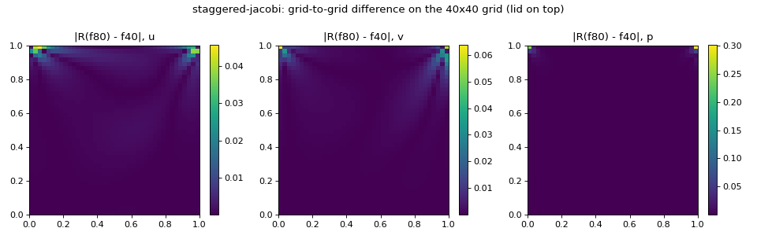
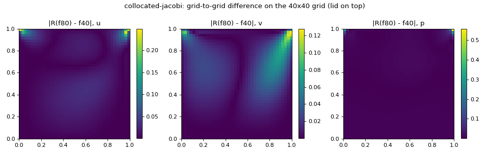
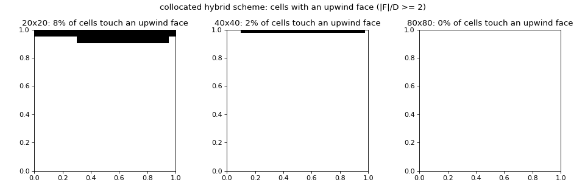

# Lid-driven cavity: each solver's order measured against itself

**Date:** 2026-09-23
**Context:** why the staggered solver's distance to Ghia et al. (reference
`ghia_1982_re100_r2`) falls by only about 1.45 per halving of h
**Instrument:** `scripts/self_convergence.py`, fields saved under `results/self_convergence/`
(gitignored). Every number below comes from that script's `summary.json` unless stated.
Provenance: MEASURED is read off the instrument, INFERRED follows from measured values by a
stated argument, HYPOTHESISED is neither, and UNKNOWN names what would settle it.

## 1. The control

The whole pipeline (2x2-block restriction, differencing, max and L2 norms, every
functional) was run first on synthetic fields F + C h^q G at the cell centers of the same
three grids, with C = 1 and known q. MEASURED:

| q | worst abs(p - q) over 14 estimates |
|---|---|
| 2 | 0.0139 |
| 1 | 0.0112 |
| 0.5 | 0.0215 |

The 14 estimates are u, v and p in both norms, the centerline extrema and the whole-domain
and regional kinetic energies. All are within the 0.05 tolerance, so the instrument
reports 1 and 0.5 when they are true, not only 2.

The synthetic pair is chosen so that the contamination terms the pipeline itself carries
stay below the tolerance:

- the restriction's own O(h^2) term, h_f^2/8 times the Laplacian of F;
- the quadratic term of the energy;
- the shift of an extremum under the error.

F has low curvature (amplitude 0.1) and an offset of 4 so that the energy is dominated by
the cross term. G is flat across each centerline pair, so the extrema respond linearly.
Centerline extrema are refined by the parabola through three samples, because a bare sample
extremum carries an O(h^2) error that is not a power law in h.

## 2. The six solves

Committed case settings, uniform meshes. MEASURED:

| Solver | 20x20 | 40x40 | 80x80 |
|---|---|---|---|
| collocated, outer iterations / s | 380 / 14 | 1571 / 98 | 5288 / 604 |
| staggered, outer iterations / s | 629 / 13 | 1891 / 60 | 5728 / 327 |

Every outer count equals the stored harness row for the same case and method.

## 3. Observed orders

d1 = R(f40) - f20 and d2 = R(f80) - f40, compared on the 20x20 grid; p = log2(||d1|| /
||R(d2)||). Pressure has its domain mean removed, because each grid pins it at a different
point. Functionals: p = log2((F20 - F40) / (F40 - F80)). MEASURED:

| Estimate | collocated | staggered |
|---|---|---|
| u, max / L2 | 0.60 / 1.07 | 1.58 / 1.79 |
| v, max / L2 | 0.66 / 1.05 | 1.07 / 1.65 |
| p, max / L2 | 0.43 / 0.70 | 0.65 / 0.60 |
| min u on x = 0.5 | 1.14 | 2.26 |
| max v on y = 0.5 | 0.79 | 2.80 |
| min v on y = 0.5 | 1.05 | 3.09 |
| kinetic energy, whole domain | 0.09 | 1.78 |
| kinetic energy inside [0.05, 0.95]^2 | 0.49 | 2.11 |
| kinetic energy in the 0.05 wall strip | 2.08 | 1.44 |
| kinetic energy inside [0.1, 0.9]^2 | 0.67 | 2.27 |
| kinetic energy in the 0.1 wall strip | not monotone | 1.54 |

No difference grows under refinement: ||R(d2)|| < ||d1|| for every field and norm of both
solvers.

**The whole-domain kinetic energy is not a valid order instrument here.** For the
collocated solver the interior energy rises with refinement and the wall-strip energy
falls. Their sum changes by an almost constant amount, 0.0034 then 0.0032, and returns an
order near zero that belongs to neither part. The regional energies are the result.

The estimates for one solver disagree with each other by more than 0.5 in order: 0.6 to
3.1 for the staggered solver, 0.1 to 2.1 for the collocated one. For the staggered solver
the split is systematic. The quantities away from the lid corners (centerline extrema,
interior energy) converge at 2.1 to 3.1, and the field norms, which the corners dominate
(section 4), at 0.6 to 1.8.

## 4. Where the difference lives

The share of the squared L2 norm of d2 on the 40x40 grid. The regions are:

- the four cells nearest each top corner (the 2x2 blocks);
- the first two cells along each wall, without those blocks;
- the interior.

The band is also split by wall, with the side walls halved at y = 0.5, and one more
region, cells within 0.15 of a top corner, cuts across the others. A difference spread
evenly would give the uniform column. MEASURED:

| Region | uniform | coll. u | coll. v | coll. p | stag. u | stag. v | stag. p |
|---|---|---|---|---|---|---|---|
| top corner blocks | 0.005 | 0.340 | 0.060 | 0.852 | 0.369 | 0.446 | 0.989 |
| wall band | 0.185 | 0.202 | 0.136 | 0.063 | 0.445 | 0.330 | 0.008 |
| interior | 0.810 | 0.458 | 0.803 | 0.085 | 0.186 | 0.224 | 0.004 |
| band: lid | 0.045 | 0.125 | 0.008 | 0.025 | 0.389 | 0.051 | 0.002 |
| band: side walls, upper half | 0.045 | 0.076 | 0.127 | 0.032 | 0.055 | 0.279 | 0.005 |
| band: side walls, lower half | 0.045 | 0.000 | 0.001 | 0.002 | 0.000 | 0.000 | 0.000 |
| band: floor | 0.050 | 0.000 | 0.000 | 0.003 | 0.000 | 0.000 | 0.000 |
| within 0.15 of a top corner | 0.035 | 0.615 | 0.223 | 0.916 | 0.833 | 0.839 | 0.998 |

The staggered solver's difference is 83% to 100% within 0.15 of the two top corners, a
region holding 3.5% of the cells, and nothing along the floor or the lower side walls. The
collocated solver's v difference is spread through the interior at the uniform share.

## 5. The distance to Ghia, taken apart

**Erratum, 2026-09-23:** the half-cell offset this section describes is fixed under a new
metric name, `max_normalized_centerline_error_r2`; see section 9. The text below is
unchanged.

`validation/metrics.py` takes the u profile from cell column nx // 2 and the v profile from
row ny // 2. Both centers sit at 0.5 + h/2, half a cell off the centerlines Ghia's tables
describe, so every stored cavity error carries a positional error of order h.

The staggered solver stores u on the face line x = 0.5 and v on y = 0.5. Its faces were
recovered exactly from the saved cell means, because each cell value is the mean of its two
faces and the wall face is zero: the residual left on the far wall is below 1e-15. The same
errors were then taken on the centerlines, everything else as the metric does it. The
collocated solver has no faces, so its centerline profile is the mean of the two cells
either side. MEASURED:

| Solver | Grid | metric u | on centerline u | metric v | on centerline v |
|---|---|---|---|---|---|
| staggered | 20x20 | 0.01632 | 0.00824 | 0.02936 | 0.00624 |
| staggered | 40x40 | 0.01113 | 0.00429 | 0.02238 | 0.00764 |
| staggered | 80x80 | 0.00770 | 0.00409 | 0.01536 | 0.00802 |
| collocated | 20x20 | 0.10602 | 0.10981 | 0.14622 | 0.15557 |
| collocated | 40x40 | 0.04077 | 0.04408 | 0.05114 | 0.06061 |
| collocated | 80x80 | 0.01342 | 0.01394 | 0.00981 | 0.01555 |

For the staggered solver the offset adds 0.023, 0.015 and 0.007 to the v error, roughly
halving with h, so it is the larger part of the metric's value at 20x20 and 40x40 and half
of it at 80x80. What remains on the centerline is a floor. From 40x40 to 80x80 it moves
from 0.0043 to 0.0041 in u and from 0.0076 to 0.0080 in v, while the solver's own centerline
extrema change by 0.0007 to 0.0016 over the same step. The floor sits at the same stations
on both grids: v more negative than Ghia by 0.005 to 0.008 at x = 0.8047, 0.8594 and
0.9063, the descending jet by the right wall, and u high by 0.004 at y = 0.8516. It does
not shrink fourfold from 40x40 to 80x80, so it is not the metric's linear interpolation
between samples.

The offset happens to flatter the collocated solver. On the centerline its 80x80 errors
are u 0.0139 and v 0.0156, both still below 2%.

## 6. The collocated solver is pre-asymptotic on these grids

The collocated momentum equation uses the hybrid scheme: a face is upwind when
abs(F) / D >= 2, where F / D = rho abs(u_face) h / mu and u_face is the two-cell mean, as
the solver forms it. From the saved converged fields, MEASURED:

| Grid | x-faces upwind | y-faces upwind | lowest upwind cell row, y |
|---|---|---|---|
| 20x20 | 8.2% | 0 | 0.925 (top two rows) |
| 40x40 | 2.2% | 0 | 0.9875 (lid row) |
| 80x80 | 0 | 0 | none |

The switch region changes between 40x40 and 80x80, from the lid row to nothing, so the
three grids mix a first-order and a second-order treatment of the layer that drives the
flow. INFERRED: a three-grid estimate straddling that change is not an asymptotic order.
That reconciles the collocated solver's low self-convergence (0.4 to 1.1) with its distance
to Ghia falling about three times per halving. The same regional energy, measured against
the staggered solver's interior value, converges at 0.9 then 1.4, rising as the switch
region shrinks. The collocated ghost-cell walls, O(h) at the wall (ADR-008), are a second
first-order source that this measurement does not separate (HYPOTHESISED).

## 7. The candidates, for the staggered solver

1. **Lid-corner singularity.** SUPPORTED for the field norms, MEASURED: 83% to 100% of the
   squared grid-to-grid difference lies within 0.15 of the top corners, which is why u, v
   and p converge at 0.6 to 1.8 in the norms. It is not what slows the approach to Ghia.
   The comparison samples the centerlines, away from the corners, and the centerline
   extrema converge at 2.3 to 3.1.
2. **Wall boundary treatment.** REJECTED, MEASURED: the floor and the lower halves of the
   side walls carry 0.000 of the squared difference against a uniform share of 0.095. The
   band's share is the corner neighbourhood: the lid band and the upper side walls.
3. **Interior scheme.** REJECTED, MEASURED: the interior carries 0.19 to 0.22 against a
   uniform 0.81, and the interior energy converges at 2.11 and 2.27.
4. **The reference floor.** SUPPORTED in part. MEASURED: on the true centerline the
   staggered solver's distance to Ghia stops falling between 40x40 and 80x80, at 0.004 in u
   and 0.008 in v, while its own centerline values change by about 0.001. UNKNOWN: whether
   that floor is Ghia's error or a consistent error in this solver's limit. Self-convergence
   cannot tell a scheme converging to the wrong answer from one converging to the right
   one. Two observations would settle it: an independent high-accuracy Re = 100 solution
   compared at x = 0.8047 to 0.9063 and y = 0.8516, or a 160x160 staggered solve showing
   whether the gap there stays fixed.
5. **OTHER: the metric's half-cell offset.** SUPPORTED, MEASURED: the metric samples at
   0.5 + h/2, which adds a first-order error, 0.023, 0.015 and 0.007 in the staggered v
   error. INFERRED: together with the floor it accounts for the metric's apparent order of
   about 0.5, a first-order term shrinking onto a constant.

**The fix the evidence points at, described and not made.** `validation/metrics.py` should
take the profiles on x = 0.5 and y = 0.5, from the faces where a solver has them and from
the two-cell mean where it does not. That changes every stored cavity error, so it wants a
new metric name, as the Ghia table correction took a new reference name, and a change of
its own.

## 8. How each number was taken

- **Control, orders, functionals, shares, maps, upwind faces and centerline errors:**
  `python scripts/self_convergence.py` on this branch, which runs the control, then solves
  or loads the six fields, then analyses them.
- **Maps:** images of abs(d2) on the 40x40 grid, one per solver, and the upwind-cell map for
  the collocated solver.
- **The collocated energy measured against the staggered interior value (section 6):** a
  hand calculation from the `ke_inside_0.05` values. The staggered 80x80 value extrapolated
  with its own order of 2.11 is 0.0202, against which the collocated errors are 0.0107,
  0.0057 and 0.0022.
- **The stations of the floor (section 5):** a one-off evaluation of the same centerline
  errors per Ghia station, not committed.

## 9. The true centerline, and whether the floor is Ghia's

**Date:** 2026-09-23. Every number in this section comes from
`python scripts/self_convergence.py --extrapolate`, which reads the six saved fields and
solves nothing, or from the tests named below.

### 9.1 The metric on the true centerline

`validation.metrics.cavity_true_centerline_errors` reports the metric
`max_normalized_centerline_error_r2` against the same reference, `ghia_1982_re100_r2`. Its
profiles interpolate linearly in x between the two cell columns whose centers bracket
x = 0.5, and in y between the two rows bracketing y = 0.5. On an even uniform grid that is
the mean of the two middle columns, and on an odd grid it is the middle column. As before,
only FLUID cells are sampled and the wall values are appended, so the only change is the
sampling position. The old function and its name are unchanged, and the stored rows keep
their meaning. The harness, the viewer and VAL-002 now use the new metric.

One property of both metrics is easy to miss. The cavity's outer ring of cells is typed
BOUNDARY, not FLUID, so both skip the wall-adjacent cell and interpolate straight from the
second cell to the wall value. At 40x40 the largest new-metric errors sit at interior
stations (y = 0.8516, x = 0.8594), so this does not set the metric's value there. MEASURED.

The tests that show the offset is gone, MEASURED:

- **Linear field, with a control.** For u = A + B x and v = A + B y on a 16x16 grid, the
  new sampling reads A + B/2 to 1e-14. The old one misses by B h/2, 0.025 here, to 1e-14
  (`tests/test_validation.py`, `TestTrueCenterlineMetric`).
- **Odd and stretched grids.** At 21x21 the new sampling equals the middle column exactly,
  and equals the old one. On meshes stretched at ratio 1.1, at 15 and 16 cells, the linear
  field reads A + B/2 to 1e-14. The mesh module stretches symmetrically, so its middle pair
  always weighs one half. A separate check on an unequal pair gives the weight from the
  distances, 0.2.
- **Agreement with the staggered faces.** `centerline_faces` recovers the staggered
  solver's faces on x = 0.5 and y = 0.5 exactly. The largest gap between the new metric's
  profile and those faces is below.

| Grid | gap in u | gap in v |
|---|---|---|
| 20x20 | 2.263e-3 | 2.528e-3 |
| 40x40 | 6.094e-4 | 6.249e-4 |
| 80x80 | 1.538e-4 | 1.557e-4 |

The gap's orders are 1.89 then 1.99 in u and 2.02 then 2.01 in v. The same gap for the old
sampling runs at 0.81 then 0.93 in u and 1.00 then 1.01 in v, which is the first-order
control. At 40x40 the largest gap is at y = 0.9125 in u and x = 0.9125 in v. On smooth
synthetic faces the two orders are 2.00 and 0.97 to 0.99 (`tests/test_self_convergence.py`).

The metric on the saved fields, MEASURED. The first two columns are the stored metric,
repeated from section 5:

| Solver | Grid | offset u | offset v | true centerline u | true centerline v |
|---|---|---|---|---|---|
| staggered | 20x20 | 0.01632 | 0.02936 | 0.00894 | 0.00656 |
| staggered | 40x40 | 0.01113 | 0.02238 | 0.00376 | 0.00803 |
| staggered | 80x80 | 0.00770 | 0.01536 | 0.00396 | 0.00813 |
| collocated | 20x20 | 0.10602 | 0.14622 | 0.10981 | 0.15557 |
| collocated | 40x40 | 0.04077 | 0.05114 | 0.04408 | 0.06061 |
| collocated | 80x80 | 0.01342 | 0.00981 | 0.01394 | 0.01555 |

The collocated values equal section 5's centerline columns, which used the same two-cell
mean. The staggered values differ from section 5's by no more than the second-order face
gap above. On the true centerline the staggered error does not fall between 40x40 and 80x80
in either component.

VAL-002 was run under the new metric and still xfails. The collocated solver at 40x40 has u
0.04408 and v 0.06061, both above 2%, as they were under the old metric.

The old and new metrics never disagree by more than the offset explains. On an even
uniform grid their difference at each row is exactly half the step between the two middle
columns. The largest station difference halves with h for the staggered solver: 0.0139,
0.0074 and 0.0037 in u, and 0.0271, 0.0144 and 0.0072 in v. For the collocated solver the v
difference does not halve from 20x20 to 40x40 (0.0115, 0.0110, 0.0067). Its gradient across
y = 0.5 at 20x20 differs from the 80x80 gradient by as much as the offset term itself,
which fits section 6's finding that it is not yet asymptotic.

### 9.2 Pointwise extrapolation of the staggered profile

**Method.** The profiles are the staggered solver's exact faces on the true centerlines at
20, 40 and 80, every row including the wall-adjacent cells, with the wall values appended.
Each is interpolated onto Ghia's stations by the cubic through the four nearest nodes. That
interpolation errs at O(h^4), two orders above the h^2 term being extrapolated. MEASURED:
raising it to the quintic through six nodes moves the interpolated values by at most
1.7e-3, 2.6e-4 and 2.6e-5 in u, and 3.9e-4, 2.1e-5 and 1.0e-6 in v, at 20, 40 and 80.
Those shifts are largest at the stations nearest the lid in u and in the jet by the right
wall in v. They move the orders by at most 0.41 in u (y = 0.9766) and 0.29 in v
(x = 0.9688), and the same stations count as second order under either interpolation. The
wall stations are left out because the walls are exact on every grid.

The order at each station is log2((f20 - f40) / (f40 - f80)). It is undefined ("reverses")
where the two steps have opposite signs. A station counts as second order when
abs(p - 2) < 0.25. That band was fixed before the fields were read: inside it the
Richardson factor 1 / (2^p - 1) stays within 27% of the 1/3 applied. Only there is the
extrapolated value f80 + (f80 - f40) / 3 formed.

**The control, which ran first.** MEASURED: a profile with a known cubic limit plus h^2
times a cubic returns order 2 and the limit to 1e-13. The same limit plus h times the cubic
returns order 1 at every station and licenses none. A profile shifted by 1e-6 from the
limit the control expects stops the script.

**The orders, MEASURED:**

| y (u profile) | order | second order | f80 - Ghia | f80 - f40 | extrapolated - Ghia |
|---|---|---|---|---|---|
| 0.9766 | 3.50 | no | +0.0019 | +0.00084 | - |
| 0.9688 | 2.75 | no | +0.0024 | +0.00150 | - |
| 0.9609 | 2.25 | no | +0.0022 | +0.00216 | - |
| 0.9531 | 2.23 | yes | +0.0027 | +0.00230 | +0.0034 |
| 0.8516 | 2.55 | no | +0.0037 | +0.00118 | - |
| 0.7344 | reverses | no | -0.0002 | -0.00013 | - |
| 0.6172 | 1.26 | no | -0.0028 | -0.00100 | - |
| 0.5000 | 2.15 | yes | -0.0027 | -0.00145 | -0.0031 |
| 0.4531 | 2.35 | no | -0.0021 | -0.00139 | - |
| 0.2813 | 3.37 | no | +0.0002 | -0.00048 | - |
| 0.1719 | 5.84 | no | +0.0006 | -0.00005 | - |
| 0.1016 | reverses | no | +0.0004 | +0.00007 | - |
| 0.0703 | reverses | no | +0.0015 | +0.00011 | - |
| 0.0625 | reverses | no | +0.0002 | +0.00011 | - |
| 0.0547 | reverses | no | +0.0002 | +0.00012 | - |

| x (v profile) | order | second order | f80 - Ghia | f80 - f40 | extrapolated - Ghia |
|---|---|---|---|---|---|
| 0.9688 | 3.58 | no | -0.0029 | -0.00008 | - |
| 0.9609 | reverses | no | -0.0038 | +0.00002 | - |
| 0.9531 | reverses | no | -0.0044 | +0.00007 | - |
| 0.9453 | reverses | no | -0.0050 | +0.00012 | - |
| 0.9063 | reverses | no | -0.0073 | +0.00024 | - |
| 0.8594 | 5.88 | no | -0.0083 | -0.00006 | - |
| 0.8047 | 3.08 | no | -0.0069 | -0.00083 | - |
| 0.5000 | 1.46 | no | +0.0031 | +0.00012 | - |
| 0.2344 | 2.88 | no | +0.0029 | +0.00092 | - |
| 0.2266 | 2.90 | no | +0.0028 | +0.00092 | - |
| 0.1563 | 2.98 | no | +0.0026 | +0.00081 | - |
| 0.0938 | 3.26 | no | +0.0022 | +0.00046 | - |
| 0.0781 | 3.48 | no | +0.0019 | +0.00032 | - |
| 0.0703 | 3.60 | no | +0.0018 | +0.00024 | - |
| 0.0625 | 3.79 | no | +0.0017 | +0.00016 | - |

**The answer: extrapolation is not licensed, and the question stays open.** Every station
here is at least 0.5 from a lid corner. Only 2 of the 30 stations are second order, both in
u, and none of the floor's stations is among them. A band twice as wide admits 4 of 30.
The orders are not scattered noise:

- On the left half of the v profile, seven stations from x = 0.0625 to 0.2344 agree on 2.9
  to 3.8.
- In the jet by the right wall, four v stations from x = 0.9063 to 0.9609 reverse. The
  profile moves away from Ghia from 20x20 to 40x40 and slightly back from 40x40 to 80x80.
- Near the floor, four u stations from y = 0.0547 to 0.1016 reverse, with steps of about
  1e-4.

Three grids do not reach the asymptotic range of a single power of h at these stations.

**Reported as found, not as an answer.**

- At the two second-order stations the extrapolated profile differs from Ghia by +0.0034
  (y = 0.9531) and -0.0031 (y = 0.5000). That is farther than at 80x80 (+0.0027 and
  -0.0027), so there the extrapolation moves away from Ghia. Neither is a floor station.
- At the four floor stations the last refinement moved the profile much less than the
  distance left. At y = 0.8516, x = 0.8594 and x = 0.8047 it moved away from Ghia, by
  0.00118, 0.00006 and 0.00083 against distances of 0.0037, 0.0083 and 0.0069. At
  x = 0.9063 it moved toward Ghia, by 0.00024 against 0.0073. At y = 0.8516 the profile
  crossed Ghia's value between 20x20 and 40x40 and has moved away since.
- Reading "the gap is Ghia's" from those steps needs convergence to be monotone beyond
  80x80. Four of the seven jet stations reversed direction across the three grids, so that
  is not established. UNKNOWN. The two observations that section 7, candidate 4 names would
  settle it: a 160x160 staggered solve, which gives the jet stations a fourth grid, or an
  independent high-accuracy Re = 100 solution at x = 0.8047 to 0.9063 and y = 0.8516.

### 9.3 How each number in this section was taken

- **Metric values, face gaps and the extrapolation:** `python scripts/self_convergence.py
  --extrapolate`, which writes `results/self_convergence/extrapolation.json`.
- **Gap orders:** `pytest tests/test_self_convergence.py -s`, which prints them when the
  saved fields are present.
- **VAL-002:** `pytest tests/test_lid_cavity.py -s`.
- **Old against new per station, and the 40x40 station locations:** one-off evaluations of
  the two profile functions on the saved fields, not committed.
