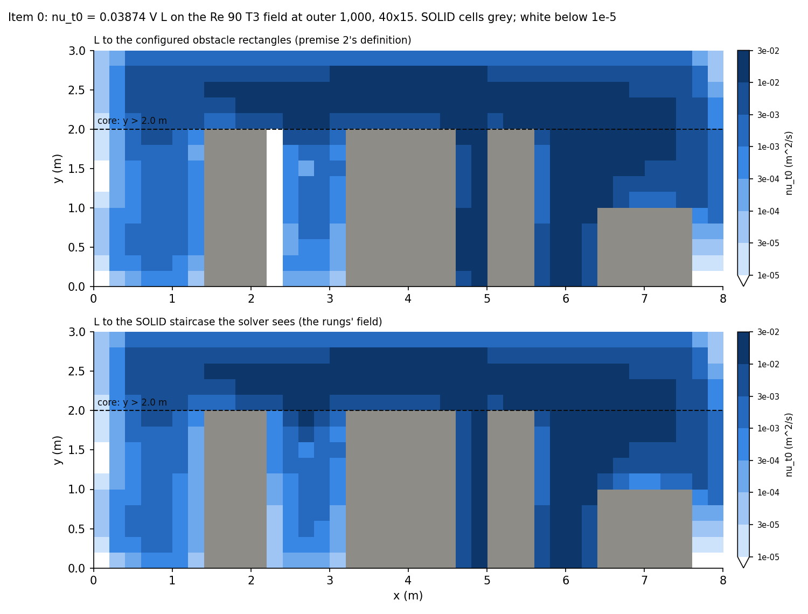
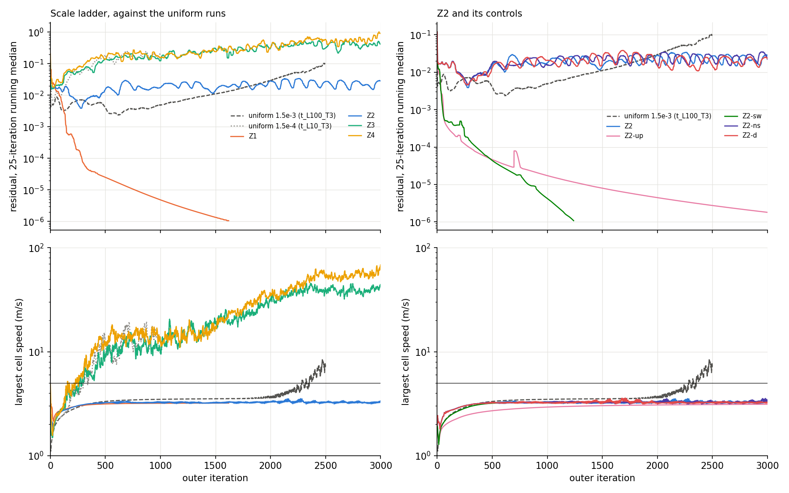

# ECR-002 Step 0: The Room Under a Frozen Eddy Viscosity

**Date:** 2026-10-04
**Tree:** branch `docs/ecr002-step0-probe` from main at f8bc4b6. `src/` is unchanged; the probes
import it and patch nothing in it.
**Instruments:** `results/builder34/` (untracked): `base34.py` (item 0), `frozen34.py` (the probe,
its controls and self-tests), `compare34.py` (the control comparison, the classification and the
figures), `diff34.py` (the lines of the probe that differ from `src/momentum.py`) and the launcher
`run34.sh`, carried verbatim in the appendices so this report stands without them; and
`cap34.py`, a diagnostic added after the rungs started (section 6.4, appendix F).
**Order:** sections 1 to 5 and the appendices were committed before any rung ran (prompt 34,
commit 2). Section 6 was written after the runs. The rung logs' first lines carry their start
times, which section 6.1 sets against the commit's time.

## 1. The question

ADR-012 decision 9 (Alex, 2026-10-04): before anything of the turbulence model is built, does the
room's iteration converge at a realistic effective viscosity? Every later step of ECR-002 assumes
that it can.

The laminar record on the 40x15 room under the T3 outlets (`docs/reports/product_case_reynolds.md`,
sections 4 and 8, and `/cfd-test 33b`), alpha_velocity 0.5, the pressure toward 1e-8 with a
40,000-sweep cap: at a thousand times air's viscosity (Re 90) the residual falls, 6.0e-6 at outer
1,701, without reaching the solver's own stop; at a uniform 1.5e-3 m^2/s (Re 895) the largest speed
holds near 3.5 m/s to about outer 2,000 and then departs, past 5 m/s at 2,284; at 1.5e-4 m^2/s (Re
8,950) and at real air it grows to 10 to 20 m/s and holds there. The runs that converge on this
grid have a largest speed of 3.8 to 4.1 m/s, the coarse grid's jets toward the floor returns.

This probe replaces the uniform viscosity by a non-uniform one with the shape the indoor
zero-equation model gives, `nu_t = 0.03874 V L` (Chen and Xu 1998; ECR-002 section 3.1), frozen and
added to air's viscosity in the momentum equation through the face rule and stress source of
ADR-012 D, and asks whether that settles the room at magnitudes across k-epsilon's core range.

## 2. Method

### 2.1 The room and the settings

`configs/clean_room_default.yaml` on 40x15 cells of 0.2 m, rho 1.2 kg/m^3 and air's viscosity
1.81e-5 Pa s, the four obstacles and the five outlets as configured. The outlets are T3, the
treatment ADR-012 decision 1 takes, through `OutletSolver` of `results/builder33b/outlet33b.py`
unchanged: the hood exhaust's five faces hold 0.5 m/s outward and leave the pressure correction's
outlet mask, and each outer iteration every floor-return face whose extrapolated velocity points
into the room is held at zero normal velocity and taken out of the mask. As in prompt 33b, the
hood's tangential velocity keeps the pressure outlet's zero gradient; the built segment will hold
it at zero (ADR-012 decision 1, test 33b B2). The uniform controls below were run the same way, so
the comparison is like with like. alpha_velocity 0.5, the pressure correction toward 1e-8 with a
40,000-sweep cap, the committed `velocity_step` rule with `convergence_tol` 1e-6, from rest. The
residual is the solver's: the largest change of the cell-centred velocity between outer
iterations over the reference velocity, 16.2 m/s on this grid.

### 2.2 Item 0: the base field

`base34.py` (appendix A) runs that room at a thousand times air's viscosity (Re 90) for 1,000 outer
iterations and keeps the cell-centred velocity. From it,

    nu_t0 = 0.03874 V L

with V the cell-centred speed and L the distance from the cell centre to the nearest domain edge or
configured obstacle rectangle. The four edges count whatever their type, the supply and the
outlets included; an obstacle is its configured rectangle, as the orchestrator's `zeq_probe.py`
took it (premise 2), not the staircase of SOLID cells the mesh makes of it, which on this grid
is offset from the rectangle by up to a tenth of a metre. The staircase distance is reported
beside it, and the rungs use it (section 3). SOLID cells carry nu_t0 = 0. "Fluid cells" below are
the non-SOLID cells, the ring of BOUNDARY cells included, 430 of 600; L > 0 on exactly that set.
The core is the non-SOLID cells whose centre lies above the equipment tops, y > 2.0 m: the top
five rows, 200 cells.

### 2.3 The probe

`frozen34.py` (appendix B) subclasses `OutletSolver` and, after construction, replaces the
solver's predictor object with `FrozenPredictor`, a subclass of `MomentumPredictor` with a frozen
cell field `mu_t`, so that `mu_e = mu + mu_t` per cell, `mu_t = rho s nu_t0` on the rungs. Nothing
in `src/` is imported into, patched or written: a probe that edited the package would invalidate
the bitwise control. With the field None the predictor calls `MomentumPredictor.predict` itself.

The field path copies `MomentumPredictor._assemble` as `_assemble_field` and `predict` as the
field path of `predict`. Every line that differs from `src/momentum.py` is listed in section 2.4.
What the field path does:

- **Faces (ADR-012 D).** A component's streamwise faces lie at cell centres and take the cell's
  mu_e. Its transverse faces lie at cell corners and span two half cells: across the row boundary in
  each of the two columns, the distance-weighted harmonic mean of the two cells (the flux crosses
  them in series), then the width-weighted arithmetic mean of the two columns (the half faces carry
  it in parallel). The two domain-edge rows divide by the wall distance as today, with the
  width-weighted mean of the two wall cells' mu_e. Both means are written so that equal inputs
  return the input exactly (`lerp` and `harmonic`), so with `mu_t = 0` every conductance is the
  committed one to the bit.
- **Obstacle faces (my construction).** D's rule names the domain edges only. Inside the room a
  transverse face can lie between a fluid cell and a SOLID one, where the zero-equation field is
  zero; the harmonic mean would then hold the conductance near twice the molecular value and make
  every obstacle face laminar while the domain walls take the wall cell's mu_e. For the mean, a
  SOLID cell therefore takes the value of the non-SOLID cell across the row boundary from it: an
  obstacle face is treated as the domain edges are. The committed solver's obstacle stencil is
  otherwise unchanged (ADR-012 B's obstacle wall stencil is step 4's).
- **The stress source (ADR-012 D), and the form I built.** With mu_e varying the viscous force on u
  carries `d/dx(mu_e du/dx) + d/dy(mu_e dv/dx)` beyond `div(mu_e grad u)`. On the MAC grid, with
  du/dx at cell centres and dv/dx at cell corners, that pair is exactly `mu_e d/dx(div u)` plus the
  part that comes from the variation of mu_e. The committed laminar path drops `mu d/dx(div u)`,
  which is zero on a divergence-free field. The iterate is not divergence-free: at outer 0 the
  supply's row carries the inlet flux into a field at rest, and every outer iteration the outlet
  extrapolation and the T3 closures open an imbalance in the outlet cells. D's pair as written
  therefore differs from the committed path even with mu_t = 0, by `mu d/dx(div u)`, and the two
  controls this prompt sets (the zero field reproduces real air, the uniform field reproduces the
  uniform run) cannot both hold with it. The default source, form b, drops `mu_e d/dx(div u)` as
  the committed path drops `mu d/dx(div u)` and keeps the rest: at each u face, over the four faces
  of its control volume, `(mu_face - mu_f)` times that face's stress flux, with mu_f the
  width-weighted mean of the face's two cells and mu_face the cell value on a streamwise face and
  the corner value of the face rule on a transverse one. Form d, D's pair as written, the domain
  edges' stress flux included, is form b plus `mu_f (div_E - div_W) dy` at each u face, div the
  cell divergence (a self-test checks the identity to 1.8e-16). So form b is exactly zero for any
  uniform mu_e and equals D's pair wherever the cells either side of a face are divergence-free:
  the two have the same fixed points to the continuity tolerance and differ only on the path to
  them. On the domain-edge rows the corner value and mu_f are the same mean of the same two wall
  cells, so form b has no edge term. The added rung Z2-d runs form d (section 2.5). The v
  equation takes the same terms with the axes swapped (the predictor's transposed frame). The
  source is added to the deferred correction's array before the SOLID faces are zeroed, so it is
  explicit on the current field, beside the deferred correction. No k, so no `(2/3) rho k`.
- **Switches.** `--upwind` sets the deferred correction to zero: first-order upwind, the stress
  source kept. `--sweeps N` runs N Jacobi sweeps of the under-relaxed equations on the coefficients
  and sources of the current field, the relaxation term `(1 - alpha)/alpha a_P phi` held at the
  outer iterate, the neighbours from the previous sweep; N = 1 calls the committed `_sweep`.
  `--no-stress` leaves the source out.

### 2.4 The controls inside the subclass

**Self-tests** (`frozen34.py selftest`, before any run):

| Check | Result |
|---|---|
| The face rule against a face-by-face loop over the rule as written, random field, the u and v frames | largest relative difference 1.5e-15 and 1.2e-15 on the 40x15 mesh; 5.8e-16 and 1.0e-15 on a stretched copy (ratios 1.1 and 1.15), where the distance and width weights are not one half |
| The zero field against `MomentumPredictor._assemble`, random u, v and p | all seven coefficient arrays of both components, and u* and v*, bitwise equal |
| The uniform field (99 times air's viscosity on air's) against the committed predictor at 100 times air's | u* and v* bitwise equal; form b exactly zero; D's pair as written up to 8.2e-3 on the random field, which is not divergence-free |
| Form d minus form b against `mu_f (div_E - div_W) dy`, div from the corrector's mass imbalance, random field and random mu_t, at the faces that are unknowns | largest relative difference 1.8e-16 |
| Form b against a known value: mu_e = mu + rho (1 + x), u = x, v = 0, where `(dmu_e/dx)(du/dx)` is rho per unit volume | rho times the control volume to 7.5e-15 relative |

**The three controls**, each 100 outer iterations of the room under T3 against the tester's runs
of prompt 33b (`results/tester33b/`, by `t33b_outlets.py`, which reproduced the builder's T3 bit
for bit):

| Control | Against | Residuals over 100 iterations | Largest speeds, pressure sweeps | Stress source |
|---|---|---|---|---|
| Field None (the committed `predict`) | `t_L1_T3`, real air | bitwise equal | bitwise equal, equal | none |
| Field zero, the field path | `t_L1_T3`, real air | bitwise equal (largest relative difference 0) | bitwise equal, equal | form b exactly 0; D's pair as written up to 2.3e-5 |
| Field uniform at 99 times air's viscosity, the field path | `t_L100_T3`, uniform 100 times air's | bitwise equal (0) | bitwise equal, equal | form b exactly 0; D's pair up to 9.1e-4 |

The prompt allowed 1e-9 relative for rounding. None was needed: the means return equal inputs
exactly, form b is exactly zero on a uniform field, and `1.81e-5 + 99 x 1.81e-5` is the double
`100 x 1.81e-5` here. The stress columns are the largest magnitudes over the unknown faces of both
components and the 100 iterations (N per metre of depth). D's pair would have entered both runs and
moved them from the first iteration, which is why the probe does not run it by default (section
2.3). The controls and self-tests were run with `frozen34.py` as it stands in appendix B, at 17:47
on 2026-10-04; an earlier run of the three, before the edge-row stress flux of form d was unmasked
and the form d self-test added, gave the same bitwise result.

**The lines that differ from `src/momentum.py`** (`diff34.py`, appendix D; docstrings included):

- `_assemble_field` against `_assemble`: the name and docstring; `mu` read from the cell field and
  the corner values formed (`rho, mu = self._rho, self._mu_e[id(o)]` and `corner =
  self.corner_viscosity(mu, o)` for `rho, mu = self._rho, self._mu`); the three transverse
  conductance lines with `corner[1:-1, :]`, `corner[0, :]` and `corner[-1, :]` in place of `mu`;
  the deferred correction behind `if self._deferred_on:` with zeros otherwise; and ten added lines
  that add the stress source and record its size. Every other line is the committed one, the
  streamwise conductance `d_s = mu * o.dt_cell[:, None] / o.ds_cell[None, :]` included, which
  takes the cell field by broadcasting.
- `predict` (field path): the docstring dropped; the None branch to `super().predict`; a shorter
  shape message; the stress record reset; `_assemble_field` and `_sweep_n` in place of `_assemble`
  and `_sweep`.
- `_sweep_n` against `_sweep`: N = 1 returns `self._sweep(...)`; otherwise the committed sweep's
  lines inside a loop over N.

### 2.5 The rungs

All on 40x15 under T3, air's molecular viscosity, alpha_velocity 0.5, the pressure toward 1e-8
with a 40,000-sweep cap, from rest, to 3,000 outer iterations or 100 m/s, run in parallel by
`run34.sh` (appendix E). s is the scale on nu_t0; the core medians are of `s nu_t0` over the 200
core cells.

| Run | Field | s | Core median of s nu_t0 (m^2/s) | Switches | Purpose |
|---|---|---|---|---|---|
| Z1 | zero-equation | 1 | 8.12e-3 | none | The zero-equation model as published |
| Z2 | zero-equation | 0.18466 | 1.5e-3 | none | Top of k-epsilon's range; against `t_L100_T3`, uniform at that value |
| Z3 | zero-equation | 0.061553 | 5e-4 | none | Middle |
| Z4 | zero-equation | 0.018466 | 1.5e-4 | none | Against `t_L10_T3`, uniform at that value |
| Z2-up | as Z2 | 0.18466 | 1.5e-3 | deferred correction off | Is it the scheme? (premise 4) |
| Z2-sw | as Z2 | 0.18466 | 1.5e-3 | 10 momentum sweeps per outer | Is the momentum equation under-solved? |
| Z2-ns | as Z2 | 0.18466 | 1.5e-3 | stress source off | Does the explicit source destabilize? |
| Z2-d | as Z2 | 0.18466 | 1.5e-3 | stress source as D writes it (form d) | Does the source's form decide the outcome? (added) |

Z2-d is my addition, made before any rung ran: form b departs from D's text along the path to a
fixed point (section 2.3), and Z2-d measures whether that departure changes the outcome at Z2.

The uniform controls are the tester's, not rerun: `t_L100_T3` (uniform 100 times air's viscosity,
1.51e-3 m^2/s, 2,500 outer iterations), `t_L10_T3` (10 times, 1.51e-4, 1,000) and `t_L1_T3` (real
air, 700). Z2's core median plus the molecular value is 1.515e-3 m^2/s, t_L100_T3's uniform value
1.508e-3; Z4's is 1.65e-4 against 1.51e-4.

### 2.6 What is recorded, and how a run is classified

Per outer iteration, what `outlet33b.py` records: the residual and the step it stands for in m/s,
the pressure sweeps, the largest cell-centred speed and its cell centre, the worst per-cell and
the signed domain-sum mass imbalance of the corrected faces, and per outlet segment (returns 1 to
4, the hood) the faces whose corrected velocity points into the room and the faces held closed.
Every iteration is logged, not every 25th. Beside those: the scale s, the largest magnitude of the
applied stress source and of D's pair over the unknown faces of both components, and the wall
clock. At the end the final faces, the cell-centred fields and the pressure are kept.

Each run is classified at its end, by these rules in this order (`compare34.py`, appendix C):

- **diverged**: the run stopped because the largest speed passed 100 m/s, or a field went
  non-finite;
- **converged**: the solver's own stop, the residual below `convergence_tol` 1e-6;
- **grown**: the largest speed at the end above 5 m/s;
- **falling**: over the last 500 iterations the residual ends within 10% of the window's least
  value and below half the window's first;
- **stalled**: over the last 500 iterations the residual's largest and least values within a
  factor of two, and the speed at the end under 5 m/s;
- **none of these**: reported as such, with what the history does.

The departure is the first outer iteration at which the largest speed passes 5 m/s, with its cell,
which is where the growth starts. Passages in the first 100 iterations that fall back below 5 m/s
before outer 100 are the start-up transient, reported apart; the departure is then the first
passage that does not fall back before outer 100, or the first after it. By this rule the uniform
controls depart at 2,284 at (6.1, 1.5) (`t_L100_T3`), at 295 at (6.1, 1.5) (`t_L10_T3`) and, after
a start-up transient over outers 0 to 38, at 127 at (6.9, 1.9) (`t_L1_T3`).

## 3. Item 0: the base field

`base34` ran 1,000 outer iterations, outer 0 to 999. Its residuals, pressure sweeps and largest
speeds equal prompt 33b's Re 90 T3 log (`results/builder33b/L1000_T3.log`) at all 40 iterations
that log printed, to the log's figures. At outer 999 the residual is 1.84e-5 and still falling,
and the largest speed 3.66 m/s. The field is from that iteration.

`nu_t0` in m^2/s, over the 430 non-SOLID cells and over the 200 core cells (y > 2.0 m):

| L to | Cells | 5th | 25th | Median | 75th | 95th | Largest |
|---|---|---|---|---|---|---|---|
| obstacle rectangles (premise 2) | all fluid | 2.97e-5 | 1.09e-3 | 4.87e-3 | 1.23e-2 | 3.43e-2 | 5.96e-2 |
| obstacle rectangles (premise 2) | core | 3.76e-4 | 2.23e-3 | **8.21e-3** | 1.70e-2 | 3.17e-2 | 4.14e-2 |
| SOLID staircase (the rungs') | all fluid | 5.9e-5 | 1.06e-3 | 4.40e-3 | 1.22e-2 | 3.31e-2 | 5.96e-2 |
| SOLID staircase (the rungs') | core | 3.76e-4 | 2.23e-3 | 8.12e-3 | 1.73e-2 | 3.05e-2 | 4.14e-2 |
| obstacle rectangles, outer 119 | core | 3.84e-4 | 1.91e-3 | 6.65e-3 | 1.10e-2 | 2.04e-2 | 2.81e-2 |

**The gate.** The core median under premise 2's definition is 8.21e-3 m^2/s, 545 times air's
1.51e-5, outside k-epsilon's core range of 6.5e-5 to 1.5e-3, so premise 2 stands and the rung design
goes ahead. It is 1.23 times premise 2's 6.7e-3, inside the expected factor of three. The last
row is the same computation on the field after 120 iterations, the field `zeq_probe.py` read:
6.65e-3, 3.84e-4 and 2.04e-2 reproduce premise 2's 6.7e-3, 3.8e-4 and 2.0e-2. The field grew between
the two as the Re 90 flow developed, its largest speed from 2.40 m/s at outer 119 to 3.66 at 999.



**The distance the rungs use, a departure from premise 2.** Under the rectangle distance, the ten
fluid cells of the column beside the server rack's staircase (x 2.2 to 2.4 m, y 0 to 2.0 m) have
their centres on the configured face x = 2.3 m, 3e-16 m from it, and carry nu_t0 of order 1e-19
m^2/s: the white column in the upper picture, no mixing in a column of the jet between the rack and
the litho tool, by an accident of where the configured face falls on this grid. The mesh's
staircase, which is the wall the solver has, puts the rack at x 1.4 to 2.2 m (configured 1.5 to
2.3), the litho tool at 3.2 to 4.6 (3.2 to 4.5) and the hood bench's top at 1.0 m (0.9). The rungs
take the staircase distance. The core percentiles, by which the rungs are scaled, move by about 1%
(median 8.12e-3 against 8.21e-3); 103 of the 430 fluid cells differ by more than 1%, all beside an
obstacle.

**Where Z2's field sits against the uniform 1.5e-3.** The field is a core-scaled shape, so outside
the core it need not resemble the uniform run. At Z2's scale 64% of the fluid cells carry less than
1.5e-3 (50% of the core, by construction), and the median below the core is 3.1e-4, a fifth of it.
In the jets it is several times larger: at (6.1, 1.5), in the gap over return 4 where the uniform
runs at 1.5e-3 and 1.5e-4 m^2/s depart, V is 2.83 m/s, L 0.50 m and Z2's value 1.0e-2, 6.7 times
the uniform; at (6.9, 1.9), above the hood bench beside the gap, where real air departs, 3.6e-3, and 7.0e-3 one cell nearer the gap at (6.5, 1.9) (corrected after review 34, B1: the first version gave 7.0e-3 at (6.9, 1.9));
at (4.7, 2.1), over the litho tool's right corner, 3.7e-3. Under the ceiling at the
supply's two ends, (0.5, 2.9) and (7.5, 2.9), it is 3.0e-4 and 3.1e-4 (the first version gave 3.1e-4 for both; test 34). Ten percent of the fluid cells carry
more than three times the uniform value.

## 4. What each outcome means

Written before the rungs ran, in the prompt's terms.

- **A. Z2 or a lower rung converges or falls**, with QUICK and one sweep: the iteration settles at
  a k-epsilon-sized mixing on this grid. Step 1 opens as planned; step 5 repeats the question on
  200x75 with built code.
- **B. Only Z1 converges or falls.** Mixing at the zero-equation size settles the room and
  k-epsilon's size does not. The controls say what kind of aid: Z2-sw settling points at the
  momentum solve, Z2-up at the scheme (premise 4's caveat below), Z2-ns at the stress source; none
  settling means no steady iterate at that mixing with this solver. The result goes to Alex with
  step 5's aids ranked before step 1 opens.
- **C. Nothing converges or falls, Z1 included.** Mixing above Re 895's does not settle the room
  either, so something other than the mixing size holds it off. Stop and report.

Z2-d: if it settles where Z2 does not, or the reverse, the stress source's form decides the
outcome at Z2 and step 4 must choose it by measurement; if it agrees in class, form b's choice does
not bear on the outcome.

Non-uniformity: Z2 against `t_L100_T3` and Z4 against `t_L10_T3`, each pair at about the same core
value. Their departure iterations and the cells where the growth starts say whether the field's
shape helped or hurt at the same core value.

Premise 4's caveat on Z2-up: first-order upwind on 0.2 m cells adds about `U dx / 2`, 0.045 m^2/s
at 0.45 m/s, thirty times Z2's core value. A converging upwind run shows that the iteration
settles when the scheme damps it heavily, not that QUICK will.

**What this cannot show.** The zero-equation field is large where speed times wall distance is
large, in the core and in the jets through the gaps, and small at the walls and the ceiling, where
the supply's shear layers sit. k-epsilon puts its mixing where shear makes turbulence, in those
layers. A negative result says the build carries the risk; it does not say k-epsilon will fail. A
positive one is stronger. The grid is 40x15 only: at 1.5e-3 m^2/s its cell Peclet number at 0.45
m/s is 60, which the product mesh reaches near 3e-4 m^2/s; the product mesh waits for ECR-003's
pressure solve, and step 5 repeats the question on 200x75 with built code.

## 5. Predictions

**The orchestrator's**, written before handover (prompt 34): "item 0's core median about 7e-3
m^2/s. Z1 falls without converging. Z2 grows, departing earlier than the uniform `t_L100_T3`
(before 2,284), because the field is weakest near the ceiling where the growth started in section
8. Z3 and Z4 grow sooner. Z2-up falls (premise 4: by numerical damping). Z2-sw and Z2-ns change
the departure by under 20% and not the class. Outcome B with no QUICK control settling."

**Mine**, written after item 0 and the controls and before any rung:

- Z1 falls without converging.
- Z2 stalls: no departure past 5 m/s by outer 3,000, later than `t_L100_T3`'s 2,284, and its
  residual within a factor of two over its last 500 iterations. Reasoning: every uniform T3 run on
  this grid, from real air to 1.5e-3 m^2/s, departs in the gap over return 4 or above the hood bench
  beside it, and Z2 carries five to seven times the uniform value there; but 64% of the fluid cells
  carry less than the uniform value, so I do not expect the residual to fall either.
- Z3 grows, departing after `t_L10_T3`'s 295 and before 2,284.
- Z4 grows, departing within 30% of `t_L10_T3`'s 295: below the core its field is a fifth of the
  uniform 1.5e-4, which offsets the gap's five to seven times.
- Z2-up falls, by premise 4's numerical damping.
- Z2-sw, Z2-ns and Z2-d end in Z2's class.
- Outcome B: only Z1 falls among the QUICK, one-sweep rungs, and of Z2's controls only the upwind
  one settles, which points at the scheme with premise 4's caveat.

## 6. Results (written after the runs)

### 6.1 The order of the commit and the runs

Commit 2 (e5a06cc, "docs: add ECR-002 step 0's method, base field and predictions") is dated
2026-10-04 17:52:57 -0700. All eight rung logs open with `start 2026-10-04T17:52:58`: `run34.sh`
was launched in the same shell command, after the commit returned. The subclass's self-tests and
controls ran before the commit (17:47), as section 2.4 says; they are not rungs. The diagnostic of
section 6.4 started at 18:16:19. The last rung ended at 20:15:57, 2 hours 23 minutes after the
start, so no run was stopped for cost. Every rung ran to the solver's own stop or to 3,000 outer
iterations; none passed 100 m/s.

Since commit 2, `compare34.py` changed in its figure only (the running median of the residual and
a log axis for the speed); its classification and departure rules are as committed. `frozen34.py`,
`base34.py`, `diff34.py` and `run34.sh` are unchanged. `cap34.py` (appendix F) is new.

### 6.2 The rungs

Classified by section 2.6's rules. Residuals are the solver's; "at cap" counts the outer iterations
whose pressure correction stopped at the 40,000-sweep cap rather than at 1e-8.

| Run | Class | Outer run | Residual: least (at outer), end | Largest speed at end, cell | Past 5 m/s: departure, cell | At cap |
|---|---|---|---|---|---|---|
| Z1 | **converged** | 1,621 | 9.97e-7 (1,620), 9.97e-7 | 3.20 m/s, (4.7, 2.1) | never | 606 |
| Z2 | none of these | 3,000 | 3.10e-3 (273), 2.83e-2 | 3.34, (6.1, 0.9) | never; largest 3.5 | 2,958 |
| Z3 | grown | 3,000 | 1.31e-2 (7), 5.52e-1 | 44.1, (6.9, 2.3) | 265, (6.3, 1.7) | 2,978 |
| Z4 | grown | 3,000 | 1.41e-2 (17), 1.13 | 68.5, (7.3, 1.7) | 155, (6.1, 1.7) | 2,947 |
| Z2-up | stalled | 3,000 | 1.78e-6 (2,999), 1.78e-6 | 3.12, (4.7, 2.1) | never | 691 |
| Z2-sw | **converged** | 1,240 | 9.97e-7 (1,239), 9.97e-7 | 3.26, (4.7, 2.1) | never | 659 |
| Z2-ns | none of these | 3,000 | 3.84e-3 (273), 1.65e-2 | 3.28, (6.1, 0.9) | never; largest 3.6 | 2,947 |
| Z2-d | none of these | 3,000 | 3.35e-3 (270), 2.35e-2 | 3.26, (6.1, 0.9) | never; largest 3.6 | 2,945 |

The uniform controls by the same rules: `t_L100_T3` grown (2,500 run; least 2.06e-3 at 601, end
9.75e-2; 7.37 m/s at (6.3, 1.3); departure 2,284 at (6.1, 1.5); at cap 258); `t_L10_T3` grown
(1,000 run; departure 295 at (6.1, 1.5); 12.3 m/s at the end); `t_L1_T3` grown (700 run; start-up
transient over outers 0 to 38, departure 127 at (6.9, 1.9); 16.0 m/s at the end).



Reading, run by run.

*Z1, the field as published.* The residual falls throughout and the solver stops itself at
1,621, the largest speed 3.20 m/s at (4.7, 2.1), over the litho tool's right corner, where the
uniform Re 90 runs put it. The uniform Re 90 field this nu_t0 was made from had fallen only to
1.84e-5 at outer 999, where Z1 stood at 4.68e-6, and no uniform run on this grid reached the
solver's stop in 3,000 iterations (`docs/reports/product_case_reynolds.md`, section 8.4). At the stop
one face of return 2 is held shut by T3 and no outlet face draws air in.

*Z2, the top of k-epsilon's range.* The speed never passes 5 m/s: from outer 500 it holds at 3.1 to
3.5 m/s, where the uniform control at the same core value departs at 2,284. The residual does not
fall: least 3.10e-3 at 273, then between 1e-2 and 3.4e-2, a slow oscillation of roughly 120
iterations (the figure), max over min 2.7 across the last 500, which no rule of section 2.6
matches. At outer 2,999 the iterate differs from Z2-sw's converged field by 0.066 m/s in the
median fluid cell, over the 430 non-SOLID cells (the first version gave 0.025, a median over all
600 cells, the 170 SOLID ones included; review 34, B1), and by up to 1.09 m/s at (6.5, 1.9), above the hood bench beside the gap over return
4. Against `t_L100_T3` the residual is higher for the first 1,500 iterations (medians
per 500 iterations 9.9e-3, 1.7e-2 and 2.1e-2 against 5.5e-3, 3.5e-3 and 7.7e-3) and lower after
2,000, where the uniform run grows (2.6e-2 against 5.2e-2 over 2,000 to 2,500).

*Z3 and Z4, the middle and bottom of the range.* Both depart in the gap over return 4, Z3 at 265 at
(6.3, 1.7) and Z4 at 155 at (6.1, 1.7), and grow to 44 and 68 m/s by 3,000, Z4 still rising at the
end. Each floor return has every one of its faces held shut at some iteration, never all four
returns at once, and the correction turns every face of returns 1 to 3 inward at some iteration. Z4 departs 140 iterations before `t_L10_T3` (295, at
(6.1, 1.5)), and the two are at similar speeds by outer 1,000 (13.3 and 12.3 m/s); the uniform run
was not continued past 1,000.

*Z2-sw, ten momentum sweeps per outer iteration.* Converged at 1,240 by the solver's own stop. The
residual falls geometrically, 0.9939 per iteration at the end; the largest speed settles at 3.26
m/s at (4.7, 2.1); no outlet face draws air in at any iteration, and one face of return 2 is held
shut; the worst per-cell mass imbalance is 3.75e-6 kg/s per metre of depth against a supply of
3.78; the pressure corrections fall from the cap to 2,544 sweeps at the stop. Per outer iteration it
cost 2.04 s against Z2's 2.84 s, because its pressure corrections left the cap as it converged; the
ten sweeps themselves are a small part of the cost.

*Z2-up, first-order upwind.* Its residual falls at every one of its last 500 iterations, from
2.71e-6 to 1.78e-6, a factor of 0.66 at 0.99916 per iteration. Falling as section 2.6 defines it
needs a halving over the window, so the rule classes it stalled. At that rate it would reach 1e-6
about 690 iterations later. Its field is upwind's, not QUICK's: at the end it differs from Z2-sw's
converged field by up to 1.56 m/s at (5.7, 1.1), 0.195 m/s in the median fluid cell (premise 4).

*Z2-ns and Z2-d, the stress source off and as D writes it.* Both follow Z2: no departure, largest
speed 3.6 m/s, residual oscillating between 1e-2 and 4e-2. Neither the source nor its form decides
the outcome at Z2. On the converged runs the applied source (form b) equals D's pair to the figures
recorded (Z1 0.0294, Z2-sw 0.00517 at the stop), as it should on a divergence-free field.

**The iteration error the stop leaves.** Both converged runs stopped by the committed
`velocity_step` rule, a step below 1e-6 of the reference velocity. At their final rates the
iteration error left is about rho / (1 - rho) times the last step
(`docs/reports/stopping_rule_evidence.md`): 450 times for Z1 and 160 times for Z2-sw, about 7e-3 and
3e-3 m/s. Both iterates are converging; neither is converged to the field's accuracy, which this
step does not ask.

### 6.3 Against the uniform controls

| Pair | Core value (m^2/s) | Departure, cell | End state |
|---|---|---|---|
| Z2 against `t_L100_T3` | 1.515e-3 against 1.508e-3 | none in 3,000 against 2,284 at (6.1, 1.5) | 3.3 m/s, residual 1e-2 to 3e-2, against grown, 7.4 m/s at 2,500 |
| Z4 against `t_L10_T3` | 1.65e-4 against 1.51e-4 | 155 at (6.1, 1.7) against 295 at (6.1, 1.5) | grown, 68.5 m/s at 3,000, against grown, 12.3 m/s at 1,000 |

At the top of the range the field's shape helped: no departure where the uniform run departs at
2,284, though Z2's residual sat higher than the uniform run's for the first 1,500 iterations. At
the bottom it hurt: Z4 departs 140 iterations earlier. Z4 and both uniform controls depart in the
gap over return 4, where at every scale the field carries five to seven times the uniform value at
the same core median (section 3). So at the bottom of the range the growth starts where the field
is strongest, and section 5's reasoning, that more mixing in the gap would hold the growth off
there, does not hold.

### 6.4 The pressure cap (a diagnostic added after commit 2)

Every rung corrected its pressure at the 40,000-sweep cap on most outer iterations (section 6.2,
last column), where `t_L100_T3` reached it on 258 of 2,500, so the cap was a difference between Z2
and its control that the design did not hold fixed. I added one diagnostic after commit 2, while
the rungs ran, `cap34.py` (appendix F): Z2 for 500 outer iterations with the cap at 400,000,
everything else as Z2. It is not a rung, it is not classified, and it changes neither s,
alpha_velocity nor the pressure tolerance. With the cap raised every correction reached 1e-8 (6,522
to 206,409 sweeps, median 86,467), and the history is Z2's:

| Outer | Z2, cap 40,000: residual median [least, largest], largest speed | Cap 400,000 |
|---|---|---|
| 0 to 99 | 1.66e-2 [9.6e-3, 1.2e-1], 2.68 m/s | 1.66e-2 [9.6e-3, 1.2e-1], 2.68 m/s |
| 100 to 199 | 1.29e-2 [7.5e-3, 2.3e-2], 2.92 | 1.29e-2 [7.5e-3, 2.3e-2], 2.91 |
| 200 to 299 | 5.38e-3 [3.1e-3, 8.9e-3], 3.09 | 5.93e-3 [3.7e-3, 8.9e-3], 3.08 |
| 300 to 399 | 8.24e-3 [5.4e-3, 1.5e-2], 3.19 | 7.98e-3 [4.0e-3, 1.4e-2], 3.18 |
| 400 to 499 | 1.12e-2 [6.9e-3, 1.9e-2], 3.25 | 9.18e-3 [4.8e-3, 1.6e-2], 3.25 |

Over the first 100 iterations the two residuals differ by 2.8e-6 to 7.3e-3 relative, median
3.7e-4 (the first version gave 1e-4 to 7e-4, which fits about the first ten iterations; review
34, B1). What carries the conclusion is the table: the per-100 medians stay within 20% of each
other to outer 499, near 1e-2, where the converging runs sit at 2.8e-5 (Z1) and 5.4e-5 (Z2-sw)
over outers 400 to 499. They part slowly
after, as test 33b found for the cap on T3 at Re 8,950. The cap is not what keeps Z2 from settling;
Z1 and Z2-sw converged under it.

### 6.5 Which outcome

**B.** Among the QUICK, one-sweep rungs only Z1 converges or falls: Z2 neither falls nor departs,
and Z3 and Z4 grow. Mixing at the zero-equation size settles the room on this grid, and
k-epsilon's size does not with the solver as committed. The controls say what kind of aid, in
commit 2's terms:

- **Z2-sw converged: the momentum solve.** With ten Jacobi sweeps of the momentum equations per
  outer iteration the same discrete equations, QUICK and the same frozen field, converge at 1,240.
  A steady solution of the frozen Z2 problem exists on this grid, and it is an unstable fixed
  point of the one-sweep iteration. Test 34 (check 19) started the one-sweep iteration on Z2-sw's
  converged field and it left at about 3% per outer iteration, the residual rising from 1.9e-6 to
  4.7e-3 by outer 300, while the same start under ten sweeps, and Z1's converged field under one
  sweep, held. From rest the one-sweep iterate oscillates around the solution, 0.066 m/s from it
  in the median fluid cell and up to 1.1 m/s above the hood bench at outer 2,999. More sweeps
  change the iteration's stability, not only its speed. (Corrected after test 34, T1: the first
  version said the iteration does not reach the solution from rest and circles near it.)
- **Z2-up is stalled by the rule**, with a residual that falls at every iteration but too slowly
  for the rule's halving. By commit 2's terms the scheme control did not settle; its history says
  heavy numerical damping slows the iteration as much as it steadies it, and its field is upwind's
  (premise 4).
- **Z2-ns and Z2-d end in Z2's class:** the stress source does not destabilize, and form b against
  D's form does not decide the outcome at Z2 with one sweep. With ten sweeps D's form converges at
  1,240 to Z2-sw's field within 4.3e-5 m/s (test 34, check 20), so at Z2 the form decides the
  outcome under neither iteration; form b is ratified for step 4 (section 6.8).
- **The pressure cap** (section 6.4) is not the cause.

B says none settling would mean no steady iterate at that mixing with this solver. One settled:
there is a steady iterate at the top of k-epsilon's range, and the committed iteration's one
momentum sweep repels it (section 6.5's first point). What is not measured is whether ten sweeps also settle Z3 and Z4,
the middle and bottom of the range, where one sweep grows.

### 6.6 Step 5's convergence aids, ranked

B sends the result to Alex with step 5's aids ranked before step 1 opens. ECR-002 step 5 names three
candidates: more momentum sweeps per outer iteration, continuation in viscosity from the
zero-equation field, and pseudo-transient continuation.

1. **More momentum sweeps per outer iteration.** The only aid measured to converge at k-epsilon's
   mixing size: Z2 with ten sweeps converged where one sweep circles for 3,000 iterations around a fixed point
   it repels (section 6.5), at a lower
   cost per outer iteration than Z2's. Measured at one sweep count and at the top of the range
   only; Z3 and Z4 with ten sweeps are the first runs to add, about two hours on this grid, before
   step 5 relies on it.
2. **Continuation in viscosity from the zero-equation field.** Not measured, and with one sweep
   contradicted at Z2. The field at its published size converges with one sweep (Z1, 1,621), so it
   is a reachable start; but the continuation's end at Z2 is a fixed point the one-sweep iteration
   repels (section 6.5), so somewhere between s = 1 and s = 0.185 a one-sweep continuation would
   leave the solution it follows. It can help only together with more sweeps, which converge from
   rest without it. The committed solver starts from rest and has no hook for an initial field,
   so a continuation needs one. (Corrected after test 34, T1: the first version ranked it
   supported.)
3. **Pseudo-transient continuation.** Not measured.

Not aids, on this evidence: first-order upwind, whose field is a different answer and whose
iteration is slower (Z2-up), and the stress source's form (Z2-d). The pressure cap is not the cause
on this grid; ECR-003's pressure solve is needed on the product mesh for cost, not for this.

### 6.7 Predictions against the measurement

| Prediction | Measured |
|---|---|
| Orchestrator: item 0's core median about 7e-3 m^2/s | Held: 8.21e-3 (6.65e-3 at outer 119) |
| Orchestrator: Z1 falls without converging | Missed: converged at 1,621 |
| Orchestrator: Z2 grows, departing before 2,284 | Missed: no departure in 3,000; largest speed 3.5 m/s; class none of these |
| Orchestrator: Z3 and Z4 grow sooner | Held: Z3 departs at 265, Z4 at 155 |
| Orchestrator: Z2-up falls | Missed by the rule: stalled; its residual falls every iteration, by 0.66 over the last 500 |
| Orchestrator: Z2-sw and Z2-ns change the departure by under 20% and not the class | Held for Z2-ns; missed for Z2-sw, which converged |
| Orchestrator: outcome B with no QUICK control settling | B held; a QUICK control settled (Z2-sw) |
| Mine: Z1 falls without converging | Missed: converged |
| Mine: Z2 stalls, no departure by 3,000 | No departure held; stalled missed: the residual's spread over the last 500 is 2.7, class none of these |
| Mine: Z3 departs after 295 and before 2,284 | Missed: 265 |
| Mine: Z4 departs within 30% of 295 | Missed: 155, 47% earlier |
| Mine: Z2-up falls | Missed by the rule: stalled |
| Mine: Z2-sw, Z2-ns and Z2-d end in Z2's class | Held for Z2-ns and Z2-d; missed for Z2-sw |
| Mine: outcome B, the upwind control the one that settles | B held; the sweep control settled, not the upwind one |
| Mine: Z2 carries "five to seven times the uniform value there", in the gap and above the hood bench | Held in the gap (6.7 times at (6.1, 1.5) and (6.1, 1.7), 7.3 at (6.3, 1.7)); above the hood bench at (6.9, 1.9) it is 2.4 times, so the reasoning rested on section 3's value as first written (review 34, B1) |

My reasoning for Z2 and Z4 was that the field's extra mixing in the gap over return 4 would hold the
growth off there. Z4 departs in that gap earlier than its uniform control, so it does not; Z2's
missing departure is not explained by it either.

### 6.8 What this measurement does not settle

Section 4's limits stand: one coarse grid, a frozen field whose shape is the zero-equation model's
and not k-epsilon's, and a converged iterate stopped by the velocity-step rule. Two more, from the
results: the sweep aid is measured at one rung, and no run here continued from a converged field
(test 34's check 19 did; section 6.5).

Two constructions of this probe were not varied, and are ratified by the orchestrator after review
34 (S1, S2) with the stress source's form. The obstacle faces (section 2.3) are this probe's
construction, a choice step 4 makes for real (ADR-012 B's obstacle wall stencil). The rungs' wall
distance is to the staircase the solver sees, not the configured rectangles (section 3). The
stress source is form b, not D's pair as the prompt wrote it: form b is the committed code's own
treatment of the molecular viscosity, the prompt's zero-field control and D's pair cannot both hold
on an iterate that is not divergence-free, and at Z2 the two forms reach the same field under one
sweep and under ten (test 34, check 20). Whether ten sweeps also make Z3's and Z4's fixed points
stable is the question prompt 34b's runs answer.

## Appendix A: base34.py

```python
"""Builder probe, prompt 34, item 0: the base field the frozen eddy viscosity is made from.

Usage: python base34.py [N_OUTER [NAME]]

Runs the 40x15 room under the T3 outlets of results/builder33b/outlet33b.py at
a thousand times air's viscosity (Re 90), alpha_velocity 0.5, the pressure
toward 1e-8 with a 40,000-sweep cap, from rest, for N_OUTER outer iterations
(default 1,000; NAME, default base34, names the outputs), and keeps the
cell-centred velocity after 120 iterations and at the end. From the end field
it forms Chen and Xu's zero-equation eddy viscosity

    nu_t0 = 0.03874 V L

with V the cell-centred speed and L the distance from the cell centre to the
nearest domain edge or configured obstacle rectangle, as the orchestrator's
zeq_probe.py takes it: the four edges count whatever their type, openings
included, and an obstacle is its configured rectangle, not the staircase of
SOLID cells the mesh makes of it. The staircase distance is computed beside it
as a sensitivity. Writes NAME.npz and NAME.json beside this file; src/ is not
changed.
"""

import json
import sys
import time
from datetime import datetime
from pathlib import Path

import numpy as np
import yaml

ROOT = Path(__file__).resolve().parents[2]
sys.path.insert(0, str(ROOT))
sys.path.insert(0, str(ROOT / "results" / "builder33b"))

from outlet33b import OutletSolver, segment_names  # noqa: E402

from src.boundary_staggered import StaggeredBoundary  # noqa: E402
from src.config import SimConfig  # noqa: E402
from src.mesh import SOLID, Mesh  # noqa: E402

CHEN_XU = 0.03874
KEEP_EARLY = 120


def load_room(mu_factor: float, n_outer: int) -> tuple[dict, SimConfig]:
    """The product configuration on 40x15 with the ladder's solver settings."""
    raw = yaml.safe_load((ROOT / "configs/clean_room_default.yaml").read_text())
    raw["domain"]["nx"], raw["domain"]["ny"] = 40, 15
    raw["fluid"]["viscosity"] *= mu_factor
    block = raw["solver"]
    block["max_simple_iter"] = n_outer
    block["alpha_velocity"] = 0.5
    block["max_pressure_iter"] = 40000
    block["pressure_tol"] = 1e-8
    return raw, SimConfig.from_dict(raw)


def wall_distance(mesh: Mesh, raw: dict, staircase: bool) -> np.ndarray:
    """Distance from each cell centre to the nearest domain edge or obstacle, [ny, nx]."""
    xc, yc = np.meshgrid(mesh.xc, mesh.yc)
    width, height = float(mesh.x[-1]), float(mesh.y[-1])
    dist = np.minimum.reduce([xc, width - xc, yc, height - yc])
    if staircase:
        solid = mesh.cell_type == SOLID
        boxes = [
            (mesh.x[i], mesh.x[i + 1], mesh.y[j], mesh.y[j + 1])
            for j, i in zip(*np.nonzero(solid), strict=True)
        ]
    else:
        boxes = [(o["x_start"], o["x_end"], o["y_start"], o["y_end"]) for o in raw["obstacles"]]
    for x0, x1, y0, y1 in boxes:
        dx = np.maximum.reduce([x0 - xc, np.zeros_like(xc), xc - x1])
        dy = np.maximum.reduce([y0 - yc, np.zeros_like(yc), yc - y1])
        dist = np.minimum(dist, np.hypot(dx, dy))
    return dist


def percentiles(a: np.ndarray) -> list[float]:
    return [float(np.percentile(a, q)) for q in (5, 25, 50, 75, 95)]


def main() -> None:
    n_outer = int(sys.argv[1]) if len(sys.argv) > 1 else 1000
    tag_out = sys.argv[2] if len(sys.argv) > 2 else "base34"
    raw, cfg = load_room(1000.0, n_outer)
    mesh = Mesh(cfg)
    boundary = StaggeredBoundary(mesh, cfg)
    hood = segment_names(mesh, cfg, "right") == "hood_exhaust"
    solver = OutletSolver(mesh, cfg, boundary, "T3", 0.5, hood)
    print(f"base34 start {datetime.now().isoformat(timespec='seconds')} n_outer {n_outer}", flush=True)

    kept: dict[str, np.ndarray] = {}
    rec: dict[str, list] = {"residual": [], "sweeps": [], "max_speed": []}
    t0 = time.perf_counter()

    def callback(state) -> None:  # type: ignore[no-untyped-def]
        speed = np.hypot(state.u, state.v)
        rec["residual"].append(float(state.residual))
        rec["sweeps"].append(int(state.pressure_sweeps))
        rec["max_speed"].append(float(speed.max()))
        if state.iteration == KEEP_EARLY - 1:
            kept["u_early"], kept["v_early"] = state.u.copy(), state.v.copy()
        kept["u"], kept["v"] = state.u.copy(), state.v.copy()
        if state.iteration % 25 == 0 or state.iteration == n_outer - 1:
            print(
                f"base34 it {state.iteration:5d} res {state.residual:.3e} "
                f"sweeps {state.pressure_sweeps:6d} max|U| {speed.max():.4g} "
                f"t {time.perf_counter() - t0:7.1f}s",
                flush=True,
            )

    solver.solve_steady(on_iteration=callback)

    rho = cfg.rho
    mu_air = cfg.mu / 1000.0
    nu_air = mu_air / rho
    non_solid = mesh.cell_type != SOLID
    xc, yc = np.meshgrid(mesh.xc, mesh.yc)
    core = non_solid & (yc > 2.0)
    out: dict = {
        "stop": solver.stop_reason, "n_outer": len(rec["residual"]),
        "seconds": time.perf_counter() - t0, "nu_air": nu_air,
        "fluid_cells": int(non_solid.sum()), "core_cells": int(core.sum()), **rec,
    }
    arrays: dict[str, np.ndarray] = {"xc": mesh.xc, "yc": mesh.yc, "cell_type": mesh.cell_type}
    for tag, key_u, key_v in (("end", "u", "v"), ("early", "u_early", "v_early")):
        speed = np.hypot(kept[key_u], kept[key_v])
        for geometry in ("rect", "stair"):
            dist = wall_distance(mesh, raw, staircase=geometry == "stair")
            if geometry == "rect":
                assert np.array_equal(dist > 0.0, non_solid), "L > 0 is not the non-SOLID set"
            nut = CHEN_XU * speed * dist
            nut[~non_solid] = 0.0
            name = f"{tag}_{geometry}"
            out[name] = {
                "nut_all": percentiles(nut[non_solid]),
                "nut_core": percentiles(nut[core]),
                "nut_max": float(nut[non_solid].max()),
                "core_median_over_nu_air": float(np.median(nut[core]) / nu_air),
                "speed_all": percentiles(speed[non_solid]),
                "L_all": percentiles(dist[non_solid]),
            }
            arrays[f"nut_{name}"] = nut
            arrays[f"L_{geometry}"] = dist
        arrays[f"u_{tag}"], arrays[f"v_{tag}"], arrays[f"speed_{tag}"] = kept[key_u], kept[key_v], speed
    np.savez(Path(__file__).parent / f"{tag_out}.npz", **arrays)
    (Path(__file__).parent / f"{tag_out}.json").write_text(json.dumps(out, indent=1))
    for name in ("end_rect", "early_rect", "end_stair"):
        o = out[name]
        print(
            f"{name}: core p5..p95 {[f'{x:.3g}' for x in o['nut_core']]} "
            f"all {[f'{x:.3g}' for x in o['nut_all']]} max {o['nut_max']:.3g} "
            f"core median / nu_air {o['core_median_over_nu_air']:.0f}",
            flush=True,
        )
    print(f"base34 done {datetime.now().isoformat(timespec='seconds')} stop {solver.stop_reason}", flush=True)


if __name__ == "__main__":
    main()
```

## Appendix B: frozen34.py

```python
"""Builder probe, prompt 34 (ECR-002 step 0): the room under a frozen eddy viscosity.

Usage:
    python frozen34.py NAME FIELD [options]
    python frozen34.py selftest

FIELD is one of
    none     the predictor runs the committed code path (MomentumPredictor.predict)
    zero     the field path with mu_t = 0 everywhere
    uniform  the field path with mu_t = 99 times air's viscosity everywhere
    zeq      the field path with mu_t = rho s nu_t0, nu_t0 from base34.npz with
             L the distance to the staircase of SOLID cells (report, section 3)

Options: --n-outer N (default 3000); --scale S or --core-median M (zeq only:
s given, or s chosen so the median of s nu_t0 over the core, non-SOLID cells
above y = 2.0 m, is M); --upwind (deferred correction off); --sweeps N
(momentum Jacobi sweeps per outer iteration, default 1); --no-stress (the
stress source off); --stress-form b|d (default b, see below).

The room is the 40x15 copy of configs/clean_room_default.yaml at air's
viscosity under the T3 outlets of results/builder33b/outlet33b.py (the hood at
0.5 m/s, floor-return faces turning inward held shut each outer iteration),
alpha_velocity 0.5, the pressure toward 1e-8 with a 40,000-sweep cap, from
rest, under the committed velocity_step rule. src/ is imported and never
patched: the subclasses below replace the solver's predictor object after
construction, nothing else.

The field path (ADR-012 D, as a probe):

- The effective viscosity per cell is mu_e = mu + mu_t. A component's
  streamwise faces lie at cell centres and take the cell's mu_e. Its
  transverse faces lie at cell corners: across the row boundary in each of
  the two columns the face spans, the distance-weighted harmonic mean of the
  two cells (the flux crosses them in series); then the width-weighted
  arithmetic mean of the two columns (the half faces carry it in parallel).
  The two domain-edge rows use the width-weighted mean of the two wall cells.
  A SOLID cell takes, for this mean, the value of the non-SOLID cell across
  the row boundary from it, so an obstacle face is treated as a domain edge
  is, with the wall cell's mu_e (this extends the rule, which names domain
  edges only). Both means are written so that equal inputs return the input
  exactly; with mu_t = 0 every conductance is then the committed one to the
  bit.
- The stress source. With mu_e varying, the viscous force on u carries
  d/dx(mu_e du/dx) + d/dy(mu_e dv/dx) beyond div(mu_e grad u). On the MAC
  grid that pair equals mu_e d/dx(div u) plus the part from the variation
  of mu_e. The committed laminar path drops mu d/dx(div u), which is zero on
  a divergence-free field. Form b, the default, drops it for mu_e too and
  keeps the rest: at each u face, the sum over the four faces of its control
  volume of (mu_face - mu_f) times that face's stress flux, mu_f the
  width-weighted mean of the face's two cells. It is exactly zero for any
  uniform mu_e, and it equals D's pair wherever the field is divergence-free.
  Form d is D's pair as written, form b plus mu_f times the discrete
  d/dx(div u), the edge rows' stress flux included. On the two domain-edge
  rows the corner value and mu_f are the same mean of the same two wall
  cells, so form b has no edge term. The v equation takes the same terms
  with the axes swapped.
  Either is carried with the deferred correction as an explicit source on
  the current field.
- --upwind sets the deferred correction to zero (first-order upwind).
- --sweeps N > 1 runs N Jacobi sweeps of the under-relaxed equations on the
  coefficients and sources of the current field, the relaxation term held at
  the outer iterate. N = 1 calls the committed sweep.

Each outer iteration records what outlet33b.py records (the residual, the
step, the pressure sweeps, the largest cell-centred speed and its cell, the
worst and signed per-cell mass imbalance of the corrected faces, and per
outlet segment the faces whose corrected velocity points into the room and
the faces held closed), the scale s, the largest magnitude of the applied
stress source and of D's pair, and the wall clock; every iteration goes to
the log. A run stops at the solver's own stop, at a non-finite field, or when
the largest speed passes 100 m/s (diverged). Writes NAME.json and NAME.npz
beside this file.
"""

import argparse
import json
import math
import sys
import time
from datetime import datetime
from pathlib import Path

import numpy as np
import yaml

ROOT = Path(__file__).resolve().parents[2]
sys.path.insert(0, str(ROOT))
sys.path.insert(0, str(ROOT / "results" / "builder33b"))

from outlet33b import OutletSolver, segment_names  # noqa: E402

from src.boundary_staggered import StaggeredBoundary  # noqa: E402
from src.config import SimConfig  # noqa: E402
from src.mesh import SOLID, Mesh  # noqa: E402
from src.momentum import (  # noqa: E402
    MomentumCoefficients,
    MomentumPrediction,
    MomentumPredictor,
    _Orientation,
)

DIVERGED_SPEED = 100.0
CORE_Y = 2.0
UNIFORM_FACTOR = 99.0
HERE = Path(__file__).parent


def lerp(a: np.ndarray, b: np.ndarray, frac_b: np.ndarray) -> np.ndarray:
    """Weighted arithmetic mean a + (b - a) frac_b; exactly a when a == b."""
    return a + (b - a) * frac_b


def harmonic(a: np.ndarray, b: np.ndarray, frac_a: np.ndarray) -> np.ndarray:
    """1 / (frac_a / a + (1 - frac_a) / b), written to return a exactly when a == b."""
    frac_b = 1.0 - frac_a
    return a + (b - a) * (a * frac_b) / (frac_a * b + frac_b * a)


class FrozenPredictor(MomentumPredictor):
    """The committed predictor, plus a field path with a frozen cell viscosity."""

    def __init__(  # type: ignore[no-untyped-def]
        self, mesh, config, boundary, mu_t, deferred=True, sweeps=1, stress=True, form="b"
    ) -> None:
        super().__init__(mesh, config, boundary)
        self._mu_t = mu_t
        self._deferred_on = deferred
        self._n_sweeps = sweeps
        self._stress_on = stress
        self._form = form
        self.last_stress: dict[str, float] = {"applied": 0.0, "pair": 0.0}
        if mu_t is not None:
            mu_e = self._mu + mu_t
            self._mu_e = {id(self._for_u): mu_e, id(self._for_v): np.ascontiguousarray(mu_e.T)}

    def predict(self, u: np.ndarray, v: np.ndarray, p: np.ndarray) -> MomentumPrediction:
        if self._mu_t is None:
            return super().predict(u, v, p)
        self._check_shapes(u, v)
        if p.shape != (self._u_shape[0], self._v_shape[1]):
            raise ValueError(f"unexpected p shape {p.shape}")
        self.last_stress = {"applied": 0.0, "pair": 0.0}
        c_u = self._assemble_field(u, v, self._for_u)
        u_star = self._sweep_n(u, c_u, self._pressure_source(p, self._for_u))

        c_vt = self._assemble_field(u=v.T, v=u.T, o=self._for_v)
        v_star = self._sweep_n(v.T, c_vt, self._pressure_source(p.T, self._for_v)).T
        return MomentumPrediction(
            u_star=np.ascontiguousarray(u_star),
            v_star=np.ascontiguousarray(v_star),
            a_p_u=c_u.a_p,
            a_p_v=np.ascontiguousarray(c_vt.a_p.T),
        )

    # The face rule, in the component's own frame: cells [nt, ns].
    def corner_viscosity(self, mu: np.ndarray, o: _Orientation) -> np.ndarray:
        """mu at every transverse face of the component, shape [nt+1, ns+1]."""
        nt, ns = mu.shape
        solid = o.solid
        lo, hi = mu[:-1, :], mu[1:, :]
        lo_eff = np.where(solid[:-1, :] & ~solid[1:, :], hi, lo)
        hi_eff = np.where(solid[1:, :] & ~solid[:-1, :], lo, hi)
        d_lo = o.t_faces[1:-1] - o.t_centers[:-1]
        d_hi = o.t_centers[1:] - o.t_faces[1:-1]
        frac_lo = (d_lo / (d_lo + d_hi))[:, None]
        rows = np.empty((nt + 1, ns), dtype=np.float64)
        rows[1:-1, :] = harmonic(lo_eff, hi_eff, frac_lo)
        rows[0, :] = mu[0, :]
        rows[-1, :] = mu[-1, :]
        w_l = o.s_faces[1:-1] - o.s_centers[:-1]
        w_r = o.s_centers[1:] - o.s_faces[1:-1]
        frac_r = w_r / (w_l + w_r)
        corner = np.empty((nt + 1, ns + 1), dtype=np.float64)
        corner[:, 1:-1] = lerp(rows[:, :-1], rows[:, 1:], frac_r[None, :])
        corner[:, 0] = rows[:, 0]
        corner[:, -1] = rows[:, -1]
        return corner

    def face_viscosity(self, mu: np.ndarray, o: _Orientation) -> np.ndarray:
        """mu at the component's own storage faces, [nt, ns-1]: the two cells' width mean."""
        w_l = o.s_faces[1:-1] - o.s_centers[:-1]
        w_r = o.s_centers[1:] - o.s_faces[1:-1]
        return lerp(mu[:, :-1], mu[:, 1:], (w_r / (w_l + w_r))[None, :])

    def stress_source(
        self, u: np.ndarray, v: np.ndarray, o: _Orientation, mu: np.ndarray, corner: np.ndarray
    ) -> tuple[np.ndarray, np.ndarray]:
        """Form b and D's pair on the unknown block [nt, ns-1]."""
        ds_f = o.ds_face[1:-1]
        grad_s = (u[:, 1:] - u[:, :-1]) / o.ds_cell[None, :]
        # dv/dx at the corners, the two domain-edge rows included. There the
        # corner value equals the face's own, so form b has no edge term.
        grad_t = (v[:, 1:] - v[:, :-1]) / ds_f[None, :]
        flux_s = grad_s * o.dt_cell[:, None]
        flux_t = grad_t * ds_f[None, :]
        mu_f = self.face_viscosity(mu, o)
        mu_c = corner[:, 1:-1]
        form_b = (
            (mu[:, 1:] - mu_f) * flux_s[:, 1:]
            - (mu[:, :-1] - mu_f) * flux_s[:, :-1]
            + (mu_c[1:, :] - mu_f) * flux_t[1:, :]
            - (mu_c[:-1, :] - mu_f) * flux_t[:-1, :]
        )
        grad_div = flux_s[:, 1:] - flux_s[:, :-1] + flux_t[1:, :] - flux_t[:-1, :]
        return form_b, form_b + mu_f * grad_div

    def _assemble_field(
        self, u: np.ndarray, v: np.ndarray, o: _Orientation
    ) -> MomentumCoefficients:
        """A copy of MomentumPredictor._assemble with a cell viscosity field."""
        nt, ns1 = u.shape
        ns = ns1 - 1
        rho, mu = self._rho, self._mu_e[id(o)]
        corner = self.corner_viscosity(mu, o)
        block = (slice(None), slice(1, ns))

        # Mass fluxes: streamwise faces at s_centers [nt, ns]; transverse
        # faces at t_faces [nt+1, ns+1], columns 0 and ns unused.
        f_s = rho * 0.5 * (u[:, :-1] + u[:, 1:]) * o.dt_cell[:, None]
        f_t = np.zeros((nt + 1, ns + 1), dtype=np.float64)
        f_t[:, 1:-1] = (
            rho
            * 0.5
            * (v[:, :-1] * o.ds_cell[None, :-1] + v[:, 1:] * o.ds_cell[None, 1:])
        )

        # Diffusion conductances. The two transverse edge rows divide by the
        # wall distance the boundary layer reports and carry nothing across
        # a zero-gradient edge.
        d_s = mu * o.dt_cell[:, None] / o.ds_cell[None, :]
        d_t = np.empty((nt + 1, ns + 1), dtype=np.float64)
        d_t[1:-1, :] = corner[1:-1, :] * o.ds_face[None, :] / o.dt_face[1:-1, None]
        d_t[0, :] = np.where(
            o.low.is_dirichlet, corner[0, :] * o.ds_face / o.low.wall_distance, 0
        )
        d_t[-1, :] = np.where(
            o.high.is_dirichlet, corner[-1, :] * o.ds_face / o.high.wall_distance, 0
        )

        # Upwind coefficients on the unknown block [nt, ns-1]
        f_e, f_w = f_s[:, 1:], f_s[:, :-1]
        f_n, f_sth = f_t[1:, 1:-1], f_t[:-1, 1:-1]
        a_e = d_s[:, 1:] + np.maximum(-f_e, 0.0)
        a_w = d_s[:, :-1] + np.maximum(f_w, 0.0)
        a_n = d_t[1:, 1:-1] + np.maximum(-f_n, 0.0)
        a_sth = d_t[:-1, 1:-1] + np.maximum(f_sth, 0.0)
        a_p = a_e + a_w + a_n + a_sth + (f_e - f_w + f_n - f_sth)

        # Transverse edges: a Dirichlet value is a known neighbour and moves
        # to the source; a zero-gradient edge has phi_P as its neighbour, so
        # that coefficient leaves the diagonal. Either way no stored
        # neighbour exists beyond the edge.
        hi = o.high.is_dirichlet[1:-1]
        lo = o.low.is_dirichlet[1:-1]
        b_boundary = np.zeros((nt, ns - 1), dtype=np.float64)
        b_boundary[-1, :] += np.where(hi, a_n[-1, :] * o.high.value[1:-1], 0.0)
        b_boundary[0, :] += np.where(lo, a_sth[0, :] * o.low.value[1:-1], 0.0)
        a_p[-1, :] -= np.where(hi, 0.0, a_n[-1, :])
        a_p[0, :] -= np.where(lo, 0.0, a_sth[0, :])
        a_n[-1, :] = 0.0
        a_sth[0, :] = 0.0

        if self._deferred_on:
            b_deferred = self._deferred_correction(u, f_s, f_t, o)
        else:
            b_deferred = np.zeros((nt, ns - 1), dtype=np.float64)

        # Faces of SOLID cells are not unknowns
        solid_face = o.solid[:, :-1] | o.solid[:, 1:]
        if self._stress_on:
            form_b, pair = self.stress_source(u, v, o, mu, corner)
            applied = form_b if self._form == "b" else pair
            b_deferred = b_deferred + applied
            self.last_stress["applied"] = max(
                self.last_stress["applied"], float(np.max(np.abs(applied[~solid_face])))
            )
            self.last_stress["pair"] = max(
                self.last_stress["pair"], float(np.max(np.abs(pair[~solid_face])))
            )
        for arr in (a_p, a_e, a_w, a_n, a_sth, b_boundary, b_deferred):
            arr[solid_face] = 0.0

        def full(arr: np.ndarray) -> np.ndarray:
            out = np.zeros((nt, ns + 1), dtype=np.float64)
            out[block] = arr
            return out

        return MomentumCoefficients(
            a_p=full(a_p),
            a_s_plus=full(a_e),
            a_s_minus=full(a_w),
            a_t_plus=full(a_n),
            a_t_minus=full(a_sth),
            b_boundary=full(b_boundary),
            b_deferred=full(b_deferred),
        )

    def _sweep_n(
        self, phi: np.ndarray, c: MomentumCoefficients, b_pressure: np.ndarray
    ) -> np.ndarray:
        """N Jacobi sweeps of the under-relaxed equations; N = 1 is the committed sweep."""
        if self._n_sweeps == 1:
            return self._sweep(phi, c, b_pressure)
        alpha = self._alpha
        unknown = c.a_p > 0.0
        a_p_ur = np.where(unknown, c.a_p / alpha, 1.0)
        b = (
            c.b_boundary
            + c.b_deferred
            + b_pressure
            + (1.0 - alpha) / alpha * c.a_p * phi
        )
        interior = np.zeros_like(unknown)
        interior[:, 1:-1] = True
        current = phi
        for _ in range(self._n_sweeps):
            padded = np.pad(current, ((1, 1), (1, 1)))
            numerator = (
                c.a_s_plus * padded[1:-1, 2:]
                + c.a_s_minus * padded[1:-1, :-2]
                + c.a_t_plus * padded[2:, 1:-1]
                + c.a_t_minus * padded[:-2, 1:-1]
                + b
            )
            nxt = phi.copy()
            nxt[interior] = np.where(unknown, numerator / a_p_ur, 0.0)[interior]
            current = nxt
        return current


class FrozenSolver(OutletSolver):
    """outlet33b's T3 solver with the predictor replaced by FrozenPredictor."""

    def __init__(self, mesh, cfg, boundary, hood, mu_t, **switches) -> None:  # type: ignore[no-untyped-def]
        super().__init__(mesh, cfg, boundary, "T3", 0.5, hood)
        self._predictor = FrozenPredictor(mesh, cfg, boundary, mu_t, **switches)


class Stop(Exception):
    """Raised from the callback to end a run that has diverged."""


def build_room(
    n_outer: int, mesh_section: dict | None = None, mu_factor: float = 1.0
) -> tuple[dict, SimConfig, Mesh, StaggeredBoundary]:
    """The 40x15 room, air's viscosity unless scaled, with the ladder's solver settings."""
    raw = yaml.safe_load((ROOT / "configs/clean_room_default.yaml").read_text())
    raw["domain"]["nx"], raw["domain"]["ny"] = 40, 15
    raw["fluid"]["viscosity"] *= mu_factor
    if mesh_section is not None:
        raw["mesh"] = mesh_section
    block = raw["solver"]
    block["max_simple_iter"] = n_outer
    block["alpha_velocity"] = 0.5
    block["max_pressure_iter"] = 40000
    block["pressure_tol"] = 1e-8
    cfg = SimConfig.from_dict(raw)
    mesh = Mesh(cfg)
    return raw, cfg, mesh, StaggeredBoundary(mesh, cfg)


def core_mask(mesh: Mesh) -> np.ndarray:
    """Non-SOLID cells whose centre lies above the equipment tops."""
    _, yc = np.meshgrid(mesh.xc, mesh.yc)
    return (mesh.cell_type != SOLID) & (yc > CORE_Y)


def run(args: argparse.Namespace) -> None:
    raw, cfg, mesh, boundary = build_room(args.n_outer)
    hood = segment_names(mesh, cfg, "right") == "hood_exhaust"
    bottom_names = segment_names(mesh, cfg, "bottom")
    rho, mu = cfg.rho, cfg.mu
    scale = None
    if args.field == "none":
        mu_t = None
    elif args.field == "zero":
        mu_t = np.zeros(mesh.cell_type.shape)
    elif args.field == "uniform":
        mu_t = np.full(mesh.cell_type.shape, UNIFORM_FACTOR * mu)
    else:
        nu_t0 = np.load(HERE / "base34.npz")["nut_end_stair"]
        median0 = float(np.median(nu_t0[core_mask(mesh)]))
        scale = args.scale if args.core_median is None else args.core_median / median0
        mu_t = rho * scale * nu_t0
    switches = {
        "deferred": not args.upwind, "sweeps": args.sweeps,
        "stress": not args.no_stress, "form": args.stress_form,
    }
    solver = FrozenSolver(mesh, cfg, boundary, hood, mu_t, **switches)
    predictor = solver._predictor
    started = datetime.now().isoformat(timespec="seconds")
    print(
        f"{args.name} start {started} field {args.field} s {scale} switches {switches} "
        f"n_outer {args.n_outer}",
        flush=True,
    )

    corrector = solver._corrector
    original = corrector.correct
    latest: dict[str, np.ndarray] = {}

    def correct(prediction, p):  # type: ignore[no-untyped-def]
        result = original(prediction, p)
        latest["u"], latest["v"], latest["p"] = result.u, result.v, result.p
        return result

    corrector.correct = correct  # type: ignore[method-assign]

    segments = sorted({n for n in bottom_names if n.startswith("floor_return")}) + ["hood_exhaust"]
    masks = {n: ("bottom", bottom_names == n) for n in segments if n != "hood_exhaust"}
    masks["hood_exhaust"] = ("right", hood)
    xc, yc = np.meshgrid(mesh.xc, mesh.yc)
    ref = solver.reference_velocity
    rec: dict[str, list] = {
        "residual": [], "step": [], "sweeps": [], "max_speed": [], "at": [],
        "worst": [], "signed": [], "inflow": [], "closed": [], "stress_applied": [],
        "stress_pair": [], "clock": [],
    }
    t0 = time.perf_counter()
    last_cells: dict[str, np.ndarray] = {}

    def callback(state) -> None:  # type: ignore[no-untyped-def]
        speed = np.hypot(state.u, state.v)
        k = int(np.argmax(speed))
        top = float(speed.flat[k])
        u, v = latest["u"], latest["v"]
        imbalance = corrector.mass_imbalance(u, v)
        inflow, closed = [], []
        for n in segments:
            edge, m = masks[n]
            if edge == "bottom":
                inflow.append(int(np.sum(v[0, m] > 0.0)))
                closed.append(int(np.sum(solver.closed_bottom[m])))
            else:
                inflow.append(int(np.sum(u[m, -1] < 0.0)))
                closed.append(int(np.sum(solver.closed_right[m])))
        rec["residual"].append(float(state.residual))
        rec["step"].append(float(state.residual) * ref)
        rec["sweeps"].append(int(state.pressure_sweeps))
        rec["max_speed"].append(top)
        rec["at"].append((round(float(xc.flat[k]), 3), round(float(yc.flat[k]), 3)))
        rec["worst"].append(float(np.max(np.abs(imbalance))))
        rec["signed"].append(float(np.sum(imbalance)))
        rec["inflow"].append(inflow)
        rec["closed"].append(closed)
        rec["stress_applied"].append(predictor.last_stress["applied"])
        rec["stress_pair"].append(predictor.last_stress["pair"])
        rec["clock"].append(time.perf_counter() - t0)
        last_cells["u"], last_cells["v"], last_cells["p"] = state.u, state.v, state.p
        print(
            f"{args.name} it {state.iteration:5d} res {state.residual:.4e} "
            f"sweeps {state.pressure_sweeps:6d} max|U| {top:.4g} at {rec['at'][-1]} "
            f"inflow {inflow} closed {closed} t {rec['clock'][-1]:7.1f}s",
            flush=True,
        )
        if not math.isfinite(top) or top > DIVERGED_SPEED:
            raise Stop

    try:
        solver.solve_steady(on_iteration=callback)
        stop = solver.stop_reason
    except Stop:
        stop = "diverged"
    out = {
        "name": args.name, "field": args.field, "scale": scale, "switches": switches,
        "mu": mu, "rho": rho, "started": started, "segments": segments,
        "faces_per_segment": [int(masks[n][1].sum()) for n in segments],
        "alpha_velocity": cfg.alpha_velocity, "max_pressure_iter": cfg.max_pressure_iter,
        "pressure_tol": cfg.pressure_tol, "convergence_tol": cfg.convergence_tol,
        "reference_velocity": ref, "stop": stop, "seconds": time.perf_counter() - t0, **rec,
    }
    (HERE / f"{args.name}.json").write_text(json.dumps(out))
    np.savez(
        HERE / f"{args.name}.npz",
        u_faces=latest["u"], v_faces=latest["v"], p=latest["p"],
        u=last_cells["u"], v=last_cells["v"],
        mu_t=np.zeros(1) if mu_t is None else mu_t,
    )
    print(
        f"{args.name} done {datetime.now().isoformat(timespec='seconds')} stop {stop} "
        f"after {len(rec['residual'])}",
        flush=True,
    )


# ---------------------------------------------------------------------------
# Self-tests of the field path, before any run
# ---------------------------------------------------------------------------


def loop_corner(mu: np.ndarray, o: _Orientation) -> np.ndarray:
    """D's face rule face by face, from the coordinates, for comparison."""
    nt, ns = mu.shape
    out = np.zeros((nt + 1, ns + 1))
    for j in range(nt + 1):
        for i in range(1, ns):
            cols = []
            for c, width in ((i - 1, o.s_faces[i] - o.s_centers[i - 1]), (i, o.s_centers[i] - o.s_faces[i])):
                if j == 0:
                    val = mu[0, c]
                elif j == nt:
                    val = mu[nt - 1, c]
                else:
                    a, b = mu[j - 1, c], mu[j, c]
                    if o.solid[j - 1, c] and not o.solid[j, c]:
                        a = b
                    if o.solid[j, c] and not o.solid[j - 1, c]:
                        b = a
                    d_a = o.t_faces[j] - o.t_centers[j - 1]
                    d_b = o.t_centers[j] - o.t_faces[j]
                    val = (d_a + d_b) / (d_a / a + d_b / b)
                cols.append((width, val))
            out[j, i] = (cols[0][0] * cols[0][1] + cols[1][0] * cols[1][1]) / (cols[0][0] + cols[1][0])
    return out


def selftest() -> None:
    rng = np.random.default_rng(34)
    report: dict[str, float] = {}
    stretched = {"x": {"stretch_ratio": 1.1}, "y": {"stretch_ratio": 1.15}}
    for label, section in (("uniform mesh", None), ("stretched mesh", stretched)):
        raw, cfg, mesh, boundary = build_room(10, section)
        shape = mesh.cell_type.shape
        mu_t = cfg.rho * rng.uniform(1e-5, 1e-2, shape)
        pred = FrozenPredictor(mesh, cfg, boundary, mu_t)
        for comp, o, field in (("u", pred._for_u, pred._mu_e[id(pred._for_u)]), ("v", pred._for_v, pred._mu_e[id(pred._for_v)])):
            fast = pred.corner_viscosity(field, o)[:, 1:-1]
            slow = loop_corner(field, o)[:, 1:-1]
            report[f"face rule vs loop, {label}, {comp}"] = float(np.max(np.abs(fast - slow) / slow))

    raw, cfg, mesh, boundary = build_room(10)
    u = rng.normal(0.0, 0.5, (15, 41))
    v = rng.normal(0.0, 0.5, (16, 40))
    p = rng.normal(0.0, 0.1, (15, 40))
    boundary.apply_normal_velocity(u, v)
    committed = MomentumPredictor(mesh, cfg, boundary)
    zero = FrozenPredictor(mesh, cfg, boundary, np.zeros((15, 40)))
    for comp, args_c in (("u", (u, v, committed._for_u)), ("v", (v.T, u.T, committed._for_v))):
        c_ref = committed._assemble(*args_c)
        o_z = zero._for_u if comp == "u" else zero._for_v
        c_z = zero._assemble_field(args_c[0], args_c[1], o_z)
        same = all(
            np.array_equal(getattr(c_ref, f), getattr(c_z, f))
            for f in ("a_p", "a_s_plus", "a_s_minus", "a_t_plus", "a_t_minus", "b_boundary", "b_deferred")
        )
        report[f"zero field, {comp} coefficients bitwise equal to committed (1 = yes)"] = float(same)
    pz, pc = zero.predict(u, v, p), committed.predict(u, v, p)
    report["zero field, prediction bitwise equal (1 = yes)"] = float(
        np.array_equal(pz.u_star, pc.u_star) and np.array_equal(pz.v_star, pc.v_star)
    )

    _, cfg100, _, _ = build_room(10, mu_factor=100.0)
    committed100 = MomentumPredictor(mesh, cfg100, boundary)
    uniform = FrozenPredictor(mesh, cfg, boundary, np.full((15, 40), UNIFORM_FACTOR * cfg.mu))
    pu, p100 = uniform.predict(u, v, p), committed100.predict(u, v, p)
    report["uniform field, largest relative difference of u*, v* from committed at 100 mu"] = float(
        max(
            np.max(np.abs(pu.u_star - p100.u_star)) / np.max(np.abs(p100.u_star)),
            np.max(np.abs(pu.v_star - p100.v_star)) / np.max(np.abs(p100.v_star)),
        )
    )
    report["uniform field, form b largest |source| (exact zero expected)"] = uniform.last_stress["applied"]
    report["uniform field, D's pair largest |source| on a random field"] = uniform.last_stress["pair"]

    # Form d minus form b is mu_f times the discrete d/dx(div u): with the cell divergence from
    # the corrector's mass imbalance, (div_E - div_W) dy at each interior u face, a random mu_t.
    # Faces bounding a SOLID cell are left out: they are not unknowns, and the corrector zeroes
    # the imbalance of SOLID cells.
    from src.pressure import PressureCorrector

    imbalance = PressureCorrector(mesh, cfg, boundary).mass_imbalance(u, v) / cfg.rho
    div = imbalance / (mesh.dx_cell[None, :] * mesh.dy_cell[:, None])
    rand = FrozenPredictor(mesh, cfg, boundary, cfg.rho * rng.uniform(1e-5, 1e-2, (15, 40)))
    o = rand._for_u
    mu_r = rand._mu_e[id(o)]
    form_b, pair = rand.stress_source(u, v, o, mu_r, rand.corner_viscosity(mu_r, o))
    expected = rand.face_viscosity(mu_r, o) * (div[:, 1:] - div[:, :-1]) * mesh.dy_cell[:, None]
    unknown = ~(o.solid[:, :-1] | o.solid[:, 1:])
    report["form d - form b against mu_f (div_E - div_W) dy, largest relative error"] = float(
        np.max(np.abs(pair - form_b - expected)[unknown]) / np.max(np.abs(expected[unknown]))
    )

    # Form b on a field with known variation: mu_e = mu + rho (1 + x), u = x, v = 0, so
    # (dmu/dx)(du/dx) = rho per unit volume; the source is rho times the control volume.
    xc, _ = np.meshgrid(mesh.xc, mesh.yc)
    lin = FrozenPredictor(mesh, cfg, boundary, cfg.rho * (1.0 + xc))
    u_lin = np.tile(mesh.x, (15, 1))
    o = lin._for_u
    mu_lin = lin._mu_e[id(o)]
    form_b, _ = lin.stress_source(u_lin, np.zeros((16, 40)), o, mu_lin, lin.corner_viscosity(mu_lin, o))
    volume = o.dt_cell[:, None] * o.ds_face[None, 1:-1]
    report["linear mu, u = x: form b against rho times volume, largest relative error"] = float(
        np.max(np.abs(form_b - cfg.rho * volume) / (cfg.rho * volume))
    )
    for key, value in report.items():
        print(f"{key}: {value:.3e}")
    (HERE / "selftest34.json").write_text(json.dumps(report, indent=1))


def main() -> None:
    if len(sys.argv) > 1 and sys.argv[1] == "selftest":
        selftest()
        return
    parser = argparse.ArgumentParser()
    parser.add_argument("name")
    parser.add_argument("field", choices=["none", "zero", "uniform", "zeq"])
    parser.add_argument("--n-outer", type=int, default=3000)
    parser.add_argument("--scale", type=float, default=1.0)
    parser.add_argument("--core-median", type=float, default=None)
    parser.add_argument("--upwind", action="store_true")
    parser.add_argument("--sweeps", type=int, default=1)
    parser.add_argument("--no-stress", action="store_true")
    parser.add_argument("--stress-form", choices=["b", "d"], default="b")
    run(parser.parse_args())


if __name__ == "__main__":
    main()
```

## Appendix C: compare34.py

```python
"""Builder helper, prompt 34: the controls, the rung table and the figures.

Usage:
    python compare34.py controls
    python compare34.py rungs
    python compare34.py field      (the picture of item 0's nu_t0)
    python compare34.py histories  (residual and speed of every rung, one figure)

Reads the JSON histories frozen34.py and base34.py write beside this file and
the tester's uniform runs in results/tester33b/. Writes controls34.json,
rungs34.json and the two PNGs beside this file.

Classification of a run at its end (prompt 34, written into the report before
the rungs ran), checked in this order:
    diverged   the run stopped because the largest speed passed 100 m/s
    converged  the solver's own stop, the residual below convergence_tol
    grown      the largest speed at the end above 5 m/s
    falling    over the last 500 iterations the residual ends within 10% of
               the window's least value and below half the window's first
    stalled    over the last 500 iterations the residual's largest and least
               values within a factor of two, speed at the end under 5 m/s
    none       none of the above; reported with what the history does
The departure is the first outer iteration at which the largest speed passes
5 m/s, with its cell. Passages in the first 100 iterations that fall back
below 5 m/s before outer 100 are the start-up transient, reported apart as the
first and last such iteration; the departure is then the first passage that
does not fall back before outer 100, or the first after it.
"""

import json
import sys
from pathlib import Path

import numpy as np

HERE = Path(__file__).parent
TESTER = HERE.parent / "tester33b"
WINDOW = 500
SPEED_LINE = 5.0
TRANSIENT = 100

RUNGS = ["Z1", "Z2", "Z3", "Z4", "Z2-up", "Z2-sw", "Z2-ns", "Z2-d"]
UNIFORM = {"t_L100_T3": "uniform 1.5e-3 (t_L100_T3)", "t_L10_T3": "uniform 1.5e-4 (t_L10_T3)",
           "t_L1_T3": "real air (t_L1_T3)"}


def load(name: str) -> dict:
    path = HERE / f"{name}.json"
    if not path.exists():
        path = TESTER / f"{name}.json"
    data = json.loads(path.read_text())
    if "max_speed" not in data:
        data["max_speed"] = data["speed"]
    return data


def departure(speed: np.ndarray, at: list) -> dict:
    """First passage past 5 m/s that is not a start-up excursion, with its cell."""
    above = speed > SPEED_LINE
    out: dict = {"transient": None, "first": None, "cell": None}
    early = [i for i in range(min(TRANSIENT, len(speed))) if above[i] and not above[i:TRANSIENT].all()]
    if early:
        out["transient"] = [early[0], early[-1]]
    for i in np.nonzero(above)[0]:
        if i >= TRANSIENT or above[i:TRANSIENT].all():
            out["first"], out["cell"] = int(i), at[i]
            break
    return out


def classify(d: dict) -> dict:
    r = np.array(d["residual"])
    s = np.array(d["max_speed"])
    w = r[-WINDOW:]
    if d["stop"] == "diverged":
        cls = "diverged"
    elif d["stop"] != "max_simple_iter":
        cls = "converged"
    elif s[-1] > SPEED_LINE:
        cls = "grown"
    elif w[-1] <= 1.1 * w.min() and w[-1] < 0.5 * w[0]:
        cls = "falling"
    elif w.max() <= 2.0 * w.min():
        cls = "stalled"
    else:
        cls = "none"
    k = int(np.argmin(r))
    return {
        "class": cls, "stop": d["stop"], "outer_run": len(r),
        "least_residual": float(r[k]), "least_at": k, "end_residual": float(r[-1]),
        "window_first": float(w[0]), "window_min": float(w.min()), "window_max": float(w.max()),
        "end_speed": float(s[-1]), "end_cell": d["at"][-1], "max_speed": float(s.max()),
        "departure": departure(s, d["at"]), "scale": d.get("scale"),
        "seconds": d.get("seconds"), "started": d.get("started"),
        "sweeps_at_cap": int(np.sum(np.array(d["sweeps"]) >= 40000)),
        "most_inflow": [int(x) for x in np.max(np.array(d["inflow"] if "inflow" in d else d["reversed_prev"]), axis=0)],
        "most_closed": [int(x) for x in np.max(np.array(d["closed"]), axis=0)] if d.get("closed") else None,
    }


def controls() -> None:
    out = {}
    for mine, ref in (("C_none", "t_L1_T3"), ("C_zero", "t_L1_T3"), ("C_uniform", "t_L100_T3")):
        a, b = load(mine), load(ref)
        n = min(100, len(a["residual"]))
        ra, rb = np.array(a["residual"][:n]), np.array(b["residual"][:n])
        sa, sb = np.array(a["max_speed"][:n]), np.array(b["max_speed"][:n])
        out[mine] = {
            "against": ref, "iterations": n,
            "residuals_bitwise": bool(np.array_equal(ra, rb)),
            "largest_relative_residual_difference": float(np.max(np.abs(ra - rb) / np.abs(rb))),
            "speeds_bitwise": bool(np.array_equal(sa, sb)),
            "sweeps_equal": a["sweeps"][:n] == b["sweeps"][:n],
            "largest_stress_source": float(max(a["stress_applied"][:n])),
            "largest_stress_pair": float(max(a["stress_pair"][:n])),
        }
        print(mine, out[mine])
    (HERE / "controls34.json").write_text(json.dumps(out, indent=1))


def rungs() -> None:
    out = {}
    for name in RUNGS + list(UNIFORM):
        path = HERE / f"{name}.json"
        if name in RUNGS and not path.exists():
            continue
        out[name] = classify(load(name))
        c = out[name]
        dep = c["departure"]
        print(
            f"{name:9s} {c['class']:9s} outer {c['outer_run']:5d} least {c['least_residual']:.2e} "
            f"at {c['least_at']} end {c['end_residual']:.2e} speed {c['end_speed']:.3g} "
            f"at {c['end_cell']} departure {dep['first']} {dep['cell']} transient {dep['transient']} "
            f"s {c['scale']} cap {c['sweeps_at_cap']} inflow {c['most_inflow']} closed {c['most_closed']}"
        )
    (HERE / "rungs34.json").write_text(json.dumps(out, indent=1))


def field_picture() -> None:
    import matplotlib

    matplotlib.use("Agg")
    import matplotlib.pyplot as plt
    from matplotlib.colors import BoundaryNorm, ListedColormap

    base = np.load(HERE / "base34.npz")
    xc, yc, cell_type = base["xc"], base["yc"], base["cell_type"]
    solid = cell_type == 1
    # Sequential blue ramp of the reference palette, one step per half decade.
    ramp = ["#cde2fb", "#9ec5f4", "#6da7ec", "#3987e5", "#256abf", "#184f95", "#0d366b"]
    edges = [1e-5, 3e-5, 1e-4, 3e-4, 1e-3, 3e-3, 1e-2, 3e-2]
    cmap = ListedColormap(ramp)
    cmap.set_bad("#8d8c87")
    cmap.set_under("#ffffff")
    norm = BoundaryNorm(edges, cmap.N)
    dx, dy = xc[1] - xc[0], yc[1] - yc[0]
    extent = (xc[0] - dx / 2, xc[-1] + dx / 2, yc[0] - dy / 2, yc[-1] + dy / 2)
    panels = [
        ("nut_end_rect", "L to the configured obstacle rectangles (premise 2's definition)"),
        ("nut_end_stair", "L to the SOLID staircase the solver sees (the rungs' field)"),
    ]
    fig, axes = plt.subplots(2, 1, figsize=(10, 7.6), dpi=150)
    for ax, (key, label) in zip(axes, panels, strict=True):
        nut = base[key]
        shown = np.ma.masked_where(solid, np.minimum(nut, edges[-1] * 0.9999))
        im = ax.imshow(shown, origin="lower", extent=extent, cmap=cmap, norm=norm, aspect="equal")
        ax.axhline(2.0, color="#0b0b0b", lw=1.0, ls="--")
        ax.text(0.05, 2.04, "core: y > 2.0 m", fontsize=8, color="#0b0b0b", va="bottom")
        ax.set_ylabel("y (m)")
        ax.set_title(label, fontsize=9, loc="left")
        for spine in ("top", "right"):
            ax.spines[spine].set_visible(False)
        bar = fig.colorbar(im, ax=ax, ticks=edges, fraction=0.025, pad=0.02, extend="min")
        bar.ax.set_yticklabels([f"{e:.0e}" for e in edges], fontsize=7)
        bar.set_label("nu_t0 (m^2/s)", fontsize=8)
    axes[-1].set_xlabel("x (m)")
    fig.suptitle(
        "Item 0: nu_t0 = 0.03874 V L on the Re 90 T3 field at outer 1,000, 40x15. "
        "SOLID cells grey; white below 1e-5",
        fontsize=10, x=0.01, ha="left",
    )
    fig.tight_layout()
    fig.savefig(HERE / "ecr002_step0_base_field.png")
    print("wrote ecr002_step0_base_field.png")


def running_median(r: list, n: int = 25) -> np.ndarray:
    """Median of the last n values at each iteration (fewer at the start)."""
    a = np.asarray(r)
    return np.array([np.median(a[max(0, i - n + 1) : i + 1]) for i in range(a.size)])


def histories() -> None:
    import matplotlib

    matplotlib.use("Agg")
    import matplotlib.pyplot as plt

    colors = {
        "Z2": "#2a78d6", "Z1": "#eb6834", "Z3": "#1baf7a", "Z4": "#eda100",
        "Z2-up": "#e87ba4", "Z2-sw": "#008300", "Z2-ns": "#4a3aa7", "Z2-d": "#e34948",
    }
    refs = {"t_L100_T3": ("#52514e", "--"), "t_L10_T3": ("#8d8c87", ":")}
    groups = [
        ("Scale ladder, against the uniform runs", ["Z1", "Z2", "Z3", "Z4"], list(refs)),
        ("Z2 and its controls", ["Z2", "Z2-up", "Z2-sw", "Z2-ns", "Z2-d"], ["t_L100_T3"]),
    ]
    fig, axes = plt.subplots(2, 2, figsize=(12, 7.5), dpi=150, sharex=True)
    for col, (title, names, ref_names) in enumerate(groups):
        for ref in ref_names:
            d = load(ref)
            color, style = refs[ref]
            label = UNIFORM[ref]
            axes[0, col].semilogy(running_median(d["residual"]), color=color, ls=style, lw=1.2, label=label)
            axes[1, col].semilogy(d["max_speed"], color=color, ls=style, lw=1.2, label=label)
        for name in names:
            path = HERE / f"{name}.json"
            if not path.exists():
                continue
            d = load(name)
            axes[0, col].semilogy(running_median(d["residual"]), color=colors[name], lw=1.2, label=name)
            axes[1, col].semilogy(d["max_speed"], color=colors[name], lw=1.2, label=name)
        axes[0, col].set_title(title, fontsize=10, loc="left")
        axes[0, col].set_ylabel("residual, 25-iteration running median")
        axes[1, col].set_ylabel("largest cell speed (m/s)")
        axes[1, col].set_xlabel("outer iteration")
        axes[1, col].axhline(SPEED_LINE, color="#0b0b0b", lw=0.6)
        axes[1, col].set_ylim(1, 100)
        axes[1, col].set_xlim(0, 3000)
        axes[0, col].legend(fontsize=7, frameon=False, ncol=2)
        for row in range(2):
            ax = axes[row, col]
            ax.grid(True, color="#e4e3df", lw=0.6)
            for spine in ("top", "right"):
                ax.spines[spine].set_visible(False)
    fig.tight_layout()
    fig.savefig(HERE / "ecr002_step0_histories.png")
    print("wrote ecr002_step0_histories.png")


if __name__ == "__main__":
    {"controls": controls, "rungs": rungs, "field": field_picture, "histories": histories}[sys.argv[1]]()
```

## Appendix D: diff34.py

```python
"""Builder helper, prompt 34: every line of the probe's copies that differs from src/momentum.py.

Usage: python diff34.py

Compares, by AST-located source text, frozen34.FrozenPredictor._assemble_field
with momentum.MomentumPredictor._assemble, FrozenPredictor.predict with
MomentumPredictor.predict, and FrozenPredictor._sweep_n with
MomentumPredictor._sweep, and prints a unified diff of each pair (docstrings
included, since they are part of the copy). Writes diff34.txt beside this file.
"""

import ast
import difflib
from pathlib import Path

HERE = Path(__file__).parent
ROOT = HERE.parents[1]


def method_source(path: Path, cls: str, name: str) -> list[str]:
    text = path.read_text()
    tree = ast.parse(text)
    lines = text.splitlines()
    for node in ast.walk(tree):
        if isinstance(node, ast.ClassDef) and node.name == cls:
            for item in node.body:
                if isinstance(item, ast.FunctionDef) and item.name == name:
                    return lines[item.lineno - 1 : item.end_lineno]
    raise KeyError(f"{cls}.{name} not found in {path}")


def main() -> None:
    src = ROOT / "src" / "momentum.py"
    probe = HERE / "frozen34.py"
    out: list[str] = []
    for theirs, mine in (("_assemble", "_assemble_field"), ("predict", "predict"), ("_sweep", "_sweep_n")):
        a = method_source(src, "MomentumPredictor", theirs)
        b = method_source(probe, "FrozenPredictor", mine)
        diff = difflib.unified_diff(
            a, b, f"src/momentum.py MomentumPredictor.{theirs}",
            f"frozen34.py FrozenPredictor.{mine}", n=0, lineterm="",
        )
        out.extend(diff)
        out.append("")
    text = "\n".join(out)
    (HERE / "diff34.txt").write_text(text)
    print(text)


if __name__ == "__main__":
    main()
```

Its output, `diff34.txt`:

```diff
--- src/momentum.py MomentumPredictor._assemble
+++ frozen34.py FrozenPredictor._assemble_field
@@ -1 +1 @@
-    def _assemble(
+    def _assemble_field(
@@ -4,5 +4 @@
-        """Coefficients of the component ``u`` whose own axis is the last one.
-
-        ``u`` has shape [nt, ns+1] and ``v``, the other component, shape
-        [nt+1, ns]. For the v equation the caller passes both transposed.
-        """
+        """A copy of MomentumPredictor._assemble with a cell viscosity field."""
@@ -11 +7,2 @@
-        rho, mu = self._rho, self._mu
+        rho, mu = self._rho, self._mu_e[id(o)]
+        corner = self.corner_viscosity(mu, o)
@@ -29 +26 @@
-        d_t[1:-1, :] = mu * o.ds_face[None, :] / o.dt_face[1:-1, None]
+        d_t[1:-1, :] = corner[1:-1, :] * o.ds_face[None, :] / o.dt_face[1:-1, None]
@@ -31 +28 @@
-            o.low.is_dirichlet, mu * o.ds_face / o.low.wall_distance, 0
+            o.low.is_dirichlet, corner[0, :] * o.ds_face / o.low.wall_distance, 0
@@ -34 +31 @@
-            o.high.is_dirichlet, mu * o.ds_face / o.high.wall_distance, 0
+            o.high.is_dirichlet, corner[-1, :] * o.ds_face / o.high.wall_distance, 0
@@ -60 +57,4 @@
-        b_deferred = self._deferred_correction(u, f_s, f_t, o)
+        if self._deferred_on:
+            b_deferred = self._deferred_correction(u, f_s, f_t, o)
+        else:
+            b_deferred = np.zeros((nt, ns - 1), dtype=np.float64)
@@ -63,0 +64,10 @@
+        if self._stress_on:
+            form_b, pair = self.stress_source(u, v, o, mu, corner)
+            applied = form_b if self._form == "b" else pair
+            b_deferred = b_deferred + applied
+            self.last_stress["applied"] = max(
+                self.last_stress["applied"], float(np.max(np.abs(applied[~solid_face])))
+            )
+            self.last_stress["pair"] = max(
+                self.last_stress["pair"], float(np.max(np.abs(pair[~solid_face])))
+            )

--- src/momentum.py MomentumPredictor.predict
+++ frozen34.py FrozenPredictor.predict
@@ -1,28 +1,3 @@
-    def predict(
-        self, u: np.ndarray, v: np.ndarray, p: np.ndarray
-    ) -> MomentumPrediction:
-        """One under-relaxed Jacobi sweep of both momentum equations.
-
-        Parameters
-        ----------
-        u : np.ndarray
-            x-velocity, shape [ny, nx+1], boundary columns already set.
-        v : np.ndarray
-            y-velocity, shape [ny+1, nx], boundary rows already set.
-        p : np.ndarray
-            Pressure at cell centers, shape [ny, nx].
-
-        Returns
-        -------
-        MomentumPrediction
-            u*, v* and the un-relaxed diagonals; see that class.
-
-        Notes
-        -----
-        Under-relaxation follows the collocated solver: the diagonal is
-        divided by alpha_velocity and ``(1 - alpha) / alpha * a_P * phi`` is
-        added to the source, so the returned ``a_P`` is the un-relaxed one.
-        The pressure source is ``-(p_(s+) - p_(s-)) * face_width``, the
-        pressure difference across the control volume, which on the
-        staggered grid needs no interpolation.
-        """
+    def predict(self, u: np.ndarray, v: np.ndarray, p: np.ndarray) -> MomentumPrediction:
+        if self._mu_t is None:
+            return super().predict(u, v, p)
@@ -31,5 +6,4 @@
-            raise ValueError(
-                f"expected p of shape {(self._u_shape[0], self._v_shape[1])}, got {p.shape}"
-            )
-        c_u = self._assemble(u, v, self._for_u)
-        u_star = self._sweep(u, c_u, self._pressure_source(p, self._for_u))
+            raise ValueError(f"unexpected p shape {p.shape}")
+        self.last_stress = {"applied": 0.0, "pair": 0.0}
+        c_u = self._assemble_field(u, v, self._for_u)
+        u_star = self._sweep_n(u, c_u, self._pressure_source(p, self._for_u))
@@ -37,2 +11,2 @@
-        c_vt = self._assemble(u=v.T, v=u.T, o=self._for_v)
-        v_star = self._sweep(v.T, c_vt, self._pressure_source(p.T, self._for_v)).T
+        c_vt = self._assemble_field(u=v.T, v=u.T, o=self._for_v)
+        v_star = self._sweep_n(v.T, c_vt, self._pressure_source(p.T, self._for_v)).T

--- src/momentum.py MomentumPredictor._sweep
+++ frozen34.py FrozenPredictor._sweep_n
@@ -1 +1 @@
-    def _sweep(
+    def _sweep_n(
@@ -4 +4,3 @@
-        """One under-relaxed Jacobi sweep; non-unknown faces keep their value or zero."""
+        """N Jacobi sweeps of the under-relaxed equations; N = 1 is the committed sweep."""
+        if self._n_sweeps == 1:
+            return self._sweep(phi, c, b_pressure)
@@ -14,10 +15,0 @@
-
-        padded = np.pad(phi, ((1, 1), (1, 1)))
-        numerator = (
-            c.a_s_plus * padded[1:-1, 2:]
-            + c.a_s_minus * padded[1:-1, :-2]
-            + c.a_t_plus * padded[2:, 1:-1]
-            + c.a_t_minus * padded[:-2, 1:-1]
-            + b
-        )
-        phi_new = phi.copy()
@@ -26,2 +18,14 @@
-        phi_new[interior] = np.where(unknown, numerator / a_p_ur, 0.0)[interior]
-        return phi_new
+        current = phi
+        for _ in range(self._n_sweeps):
+            padded = np.pad(current, ((1, 1), (1, 1)))
+            numerator = (
+                c.a_s_plus * padded[1:-1, 2:]
+                + c.a_s_minus * padded[1:-1, :-2]
+                + c.a_t_plus * padded[2:, 1:-1]
+                + c.a_t_minus * padded[:-2, 1:-1]
+                + b
+            )
+            nxt = phi.copy()
+            nxt[interior] = np.where(unknown, numerator / a_p_ur, 0.0)[interior]
+            current = nxt
+        return current
```

## Appendix E: run34.sh

```sh
#!/bin/sh
# Prompt 34: the rungs, all in parallel, each to 3,000 outer iterations or 100 m/s.
# Z2-d is the builder's addition (report, section 2.5).
export OMP_NUM_THREADS=1 OPENBLAS_NUM_THREADS=1 MKL_NUM_THREADS=1
PY=../../.venv/Scripts/python
$PY frozen34.py Z1 zeq --scale 1 > Z1.log 2>&1 &
$PY frozen34.py Z2 zeq --core-median 1.5e-3 > Z2.log 2>&1 &
$PY frozen34.py Z3 zeq --core-median 5e-4 > Z3.log 2>&1 &
$PY frozen34.py Z4 zeq --core-median 1.5e-4 > Z4.log 2>&1 &
$PY frozen34.py Z2-up zeq --core-median 1.5e-3 --upwind > Z2-up.log 2>&1 &
$PY frozen34.py Z2-sw zeq --core-median 1.5e-3 --sweeps 10 > Z2-sw.log 2>&1 &
$PY frozen34.py Z2-ns zeq --core-median 1.5e-3 --no-stress > Z2-ns.log 2>&1 &
$PY frozen34.py Z2-d zeq --core-median 1.5e-3 --stress-form d > Z2-d.log 2>&1 &
wait
echo ALL DONE
```

## Appendix F: cap34.py

```python
"""Builder diagnostic, prompt 34, added after commit 2: Z2 with the pressure cap raised.

Usage: python cap34.py NAME CAP N_OUTER

Runs frozen34.py's Z2 (the zero-equation field at a core median of 1.5e-3
m^2/s, form b, QUICK, one momentum sweep) with max_pressure_iter CAP in place
of 40,000, everything else as frozen34.py. Not a rung and not classified: every
rung corrected its pressure at the 40,000-sweep cap on almost every outer
iteration, where the uniform control t_L100_T3 reached it on 258 of 2,500, and
this asks whether the cap shapes Z2's history. frozen34.py is imported and its
build_room wrapped; the file the rungs ran is unchanged.
"""

import sys

import frozen34
from src.boundary_staggered import StaggeredBoundary
from src.config import SimConfig
from src.mesh import Mesh

_original = frozen34.build_room


def main() -> None:
    name, cap, n_outer = sys.argv[1], int(sys.argv[2]), int(sys.argv[3])

    def build_room(n, mesh_section=None, mu_factor=1.0):  # type: ignore[no-untyped-def]
        raw, _, _, _ = _original(n, mesh_section, mu_factor)
        raw["solver"]["max_pressure_iter"] = cap
        cfg = SimConfig.from_dict(raw)
        mesh = Mesh(cfg)
        return raw, cfg, mesh, StaggeredBoundary(mesh, cfg)

    frozen34.build_room = build_room
    sys.argv = ["frozen34.py", name, "zeq", "--core-median", "1.5e-3", "--n-outer", str(n_outer)]
    frozen34.main()


if __name__ == "__main__":
    main()
```
